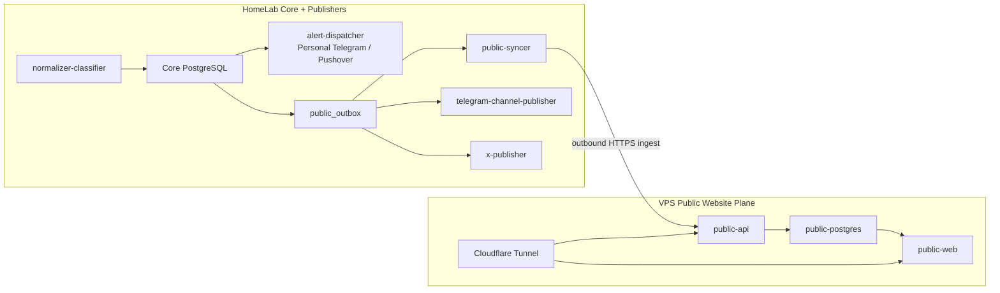

# 部署與使用方式

## 1. 部署目標

XAUUSD Event Radar V1 將部署在 HomeLab 上，以 Docker Compose 啟動所有服務。

部署模式：

```text
development machine
  ↓ build docker images
GHCR
  ↓ pull images
HomeLab server
  ↓ docker compose up
V1 services
```

V1 只部署新聞消息層：

- PostgreSQL
- `db-migrate`
- `telegram-collector`
- `rss-collector`
- `normalizer-classifier`
- `alert-dispatcher`
- `dashboard-api`，可選但建議保留作為 debug API
- `dashboard-web`，HomeLab 內網 Dashboard UI

V1 不部署：

- `mt5-collector`
- market data collector
- public website / public ingest API
- public social publishers
- RabbitMQ / Kafka

## 2. 目錄約定

所有生產部署相關文件放在專案根目錄的 `infra` 目錄。

```text
infra/
  README.md
  docker-compose.prod.yml
  .env.example
  scripts/
    docker-images.sh
```

未來可擴充：

```text
infra/
  caddy/
  postgres/
  systemd/
  scripts/
```

## 3. Image 發佈流程

所有服務以 Docker image 發佈到 GHCR。

建議 image 命名：

```text
ghcr.io/mrsuner/xauusd-trading-monitor/telegram-collector:<tag>
ghcr.io/mrsuner/xauusd-trading-monitor/db-migrate:<tag>
ghcr.io/mrsuner/xauusd-trading-monitor/rss-collector:<tag>
ghcr.io/mrsuner/xauusd-trading-monitor/normalizer-classifier:<tag>
ghcr.io/mrsuner/xauusd-trading-monitor/alert-dispatcher:<tag>
ghcr.io/mrsuner/xauusd-trading-monitor/dashboard-api:<tag>
ghcr.io/mrsuner/xauusd-trading-monitor/dashboard-web:<tag>
```

Tag 策略：

| Tag | 用途 |
| --- | --- |
| `main` | main branch 最新 build |
| git SHA | 可回滾的 immutable build |
| semver | 手動 release，例如 `v0.1.0` |

HomeLab 部署建議使用 git SHA 或 semver，不建議長期使用 `latest`。

開發機或 CI 的典型流程：

```bash
IMAGE_TAG=$(git rev-parse --short HEAD) make docker-build
IMAGE_TAG=$(git rev-parse --short HEAD) make docker-push
```

若 HomeLab 是 `linux/amd64`，而開發機是 Apple Silicon，需用 buildx 直接推送目標平台 image：

```bash
IMAGE_PLATFORM=linux/amd64 IMAGE_TAG=$(git rev-parse --short HEAD) make docker-build-push
```

這會依序 build / push：

```text
db-migrate
telegram-collector
rss-collector
normalizer-classifier
alert-dispatcher
dashboard-api
dashboard-web
```

`infra/scripts/docker-images.sh` 使用 monorepo root 作為 build context，並使用各服務自己的 Dockerfile。

## 4. HomeLab Runtime

HomeLab server 需要：

- Docker Engine
- Docker Compose plugin
- GHCR pull 權限
- 對 Local LLM server 的內網連線能力，如果使用 local model route
- 對 Telegram / RSS / Pushover / OpenAI-compatible API 的 outbound network

Local LLM 由本地網路另一台 server 提供，不放在 V1 compose 內。

示例：

```text
normalizer-classifier
  ↓ HTTP
http://192.168.1.50:11434
  ↓
Local LLM server
```

V1 預設使用 cloud small model 做事件分類；Local LLM 保留給摘要、翻譯與低風險輔助處理。如果 Local LLM 後續品質足夠，仍可透過相同 OpenAI-compatible 介面切換或作 fallback。

## 5. Secret 管理

生產 secrets 不提交到 repo。

需要配置：

```text
POSTGRES_PASSWORD
TELEGRAM_API_ID
TELEGRAM_API_HASH
TELEGRAM_BOT_TOKEN
TELEGRAM_CHAT_ID
PUSHOVER_APP_TOKEN
PUSHOVER_USER_KEY
CLOUD_MODEL_API_KEY
API_TOKEN
```

V1 可使用 HomeLab 本地 `.env` 檔案：

```text
infra/.env
```

repo 只保留：

```text
infra/.env.example
```

## 6. Persistent Volumes

需要持久化：

| Path | 用途 |
| --- | --- |
| `postgres-data` | PostgreSQL data |
| `${TELEGRAM_SESSION_HOST_DIR}` | Telethon user session |

Telethon session 特別重要：

- 同一 session 不可多實例同時使用。
- `telegram-collector` replicas 必須固定為 1。
- session file 不提交到 Git。

## 7. Compose 啟動順序

建議啟動順序：

1. `postgres`
2. `db-migrate`，執行 `alembic upgrade head`
3. `telegram-collector`
4. `rss-collector`
5. `normalizer-classifier`
6. `alert-dispatcher`
7. `dashboard-api`
8. `dashboard-web`

Docker Compose 使用 `depends_on.condition` 控制順序：application services 等待 PostgreSQL healthy，並等待 `db-migrate` `service_completed_successfully`。服務本身仍需實作 DB retry，不能只依賴 Compose 順序。

Migration 策略詳見 [Database Migration 策略](./database-migrations.md)。

## 8. 使用方式

### 8.1 首次部署

在 HomeLab server：

```bash
cd /opt/xauusd-trading-monitor
cp infra/.env.example infra/.env
mkdir -p infra/data/telegram-sessions
```

編輯 `infra/.env`，填入 secrets 與 image tag。

登入 GHCR：

```bash
docker login ghcr.io
```

拉取並啟動：

```bash
docker compose --env-file infra/.env -f infra/docker-compose.prod.yml pull
docker compose --env-file infra/.env -f infra/docker-compose.prod.yml up -d \
  --scale normalizer-classifier=${NORMALIZER_REPLICAS:-2}
```

Dashboard 預設暴露在 HomeLab server：

```text
http://<homelab-host>:5173
```

Dashboard API 預設暴露在：

```text
http://<homelab-host>:8080
```

### 8.2 更新部署

```bash
docker compose --env-file infra/.env -f infra/docker-compose.prod.yml pull
docker compose --env-file infra/.env -f infra/docker-compose.prod.yml up -d \
  --remove-orphans \
  --scale normalizer-classifier=${NORMALIZER_REPLICAS:-2}
```

也可以使用專案提供的 wrapper：

```bash
infra/scripts/prod-up.sh infra/.env infra/docker-compose.prod.yml
```

### 8.3 查看狀態

```bash
docker compose --env-file infra/.env -f infra/docker-compose.prod.yml ps
docker compose --env-file infra/.env -f infra/docker-compose.prod.yml logs -f normalizer-classifier
```

### 8.4 停止服務

```bash
docker compose --env-file infra/.env -f infra/docker-compose.prod.yml down
```

不要在正常維護時刪除 volumes。

## 9. normalizer-classifier 模型路由

`normalizer-classifier` 需要支援可切換模型路由。

V1 支援：

```text
MODEL_ROUTE=local_8b
MODEL_ROUTE=cloud_small
MODEL_ROUTE=claude_code_agent
TRANSLATION_MODEL_ENABLED=true
```

### 9.0 Worker Scale

V1 生產環境先使用 PostgreSQL `raw_item_processing` 作為 reliable queue，`normalizer-classifier` 可以水平擴展多個 container instance。任務 claim 使用 `FOR UPDATE SKIP LOCKED`，避免不同 worker 重複處理同一筆 task。

預設設定：

```text
NORMALIZER_REPLICAS=2
NORMALIZER_WORKER_CONCURRENCY=2
NORMALIZER_STALE_TASK_TIMEOUT_SECONDS=900
```

含義：

- 啟動 2 個 `normalizer-classifier` container。
- 每個 container 內部啟動 2 條 worker loop。
- 總併發約為 4，避免 paid model call 從單實例直接放大到不可控。
- running task 若 `locked_at` 超過 900 秒，下一次 claim 時會恢復為 `retry`，避免 worker crash 後永遠卡住。

不建議 scale：

- `telegram-collector`：Telethon user session 必須單實例。
- `rss-collector`：V1 暫時單實例，避免重複 polling。
- `alert-dispatcher`：V1 暫時單實例，避免重複通知。

### 9.1 Local LLM

Local LLM 適合：

- 低成本批量摘要。
- 翻譯波斯語、希伯來語、阿拉伯語等非英文內容。
- 低風險預處理與輔助資訊抽取。
- HomeLab 內網可用時。

V1 不建議 Local LLM 單獨負責最終事件分類、相關度分數、claim direction 或 severity input。這些欄位預設由 `cloud_small` 產生。

必要設定：

```text
LOCAL_MODEL_BASE_URL=http://192.168.1.50:11434
LOCAL_MODEL_NAME=...
```

### 9.2 Cloud Small Model

Cloud small model 適合：

- V1 預設事件分類。
- 高優先級來源。
- 相關度、claim direction、impact channel 與 confidence。
- Local LLM / nano summary 後的最終判斷。

必要設定：

```text
CLOUD_MODEL_BASE_URL=https://api.openai.com/v1
CLOUD_MODEL_API_KEY=...
CLOUD_MODEL_NAME=gpt-5.4-mini
CLOUD_MODEL_RESPONSE_FORMAT=json_object
```

`gpt-5.4-nano` 可作 summary / translation 輔助，但 V1 不作主分類模型。

### 9.3 OpenRouter Translation-Summary Model

OpenRouter 適合：

- 測試 free / cheap models 的繁中摘要與翻譯品質。
- 作為 local LLM 之外的外部 translation-summary route。
- 處理 `summary_zh`、`summary_en`、`full_translation_zh`、`full_translation_en` 等低風險任務。

V1 不建議 OpenRouter free model 單獨負責最終事件分類、相關度分數、claim direction 或 severity input。這些欄位預設由 `cloud_small` 產生。

必要設定：

```text
OPENROUTER_MODEL_BASE_URL=https://openrouter.ai/api/v1
OPENROUTER_MODEL_API_KEY=...
OPENROUTER_HTTP_REFERER=
OPENROUTER_APP_TITLE=XAUUSD Event Radar
TRANSLATION_MODEL_ENABLED=true
TRANSLATION_MODEL_BASE_URL=https://openrouter.ai/api/v1
TRANSLATION_MODEL_API_KEY=
TRANSLATION_PRIMARY_MODEL_NAME=openai/gpt-oss-20b:free
TRANSLATION_FALLBACK_MODEL_NAME=openai/gpt-oss-20b
TRANSLATION_PAID_FALLBACK_ENABLED=true
TRANSLATION_MODEL_RESPONSE_FORMAT=none
TRANSLATION_DEFAULT_MAX_CHARS=20000
TRANSLATION_HIGH_PRIORITY_MAX_CHARS=100000
TRANSLATION_SINGLE_CALL_MAX_CHARS=100000
```

`TRANSLATION_MODEL_API_KEY` 可留空，此時 service 會 fallback 使用 `OPENROUTER_MODEL_API_KEY`。V1 預設 paid fallback 開啟；development 可用 `MAX_TRANSLATION_CALLS_PER_RUN` 與 `MAX_TRANSLATION_PAID_FALLBACK_CALLS_PER_RUN` 控制成本。

若只想比較模型品質，使用 [OpenRouter 測試 Prompt](/Users/lukesun/Projects/ongoing/xauusd-trading-monitor/docs/model-evaluation-openrouter.md) 在 OpenRouter UI 中測試。

### 9.4 Claude Code Agent SDK，備選

Claude Code Agent SDK 可作為高階模型能力備選，適合後續需要更複雜分析、工具調用或多步判斷的場景。

V1 對它的定位：

- 備選 route。
- 不作為必需依賴。
- 不阻塞 V1 核心閉環。
- 仍必須輸出相同的 JSON schema。
- 仍不得輸出交易指令。

## 10. 公共出口部署方向，後續版本

V1 的 HomeLab Dashboard、Telegram Bot 與 Pushover 都是個人工作台與個人通知出口。後續若要讓系統服務更多公開訂閱者，不應直接把 HomeLab Dashboard 或 HomeLab API 暴露到公網，而應新增一個獨立的 public publishing plane。

建議採用：

```text
HomeLab-Controlled Publishing
VPS-Hosted Public Site
```

也就是：

- HomeLab 繼續負責資料採集、AI 處理、事件判斷、私人通知與公共發布控制。
- VPS 只負責公共網站所需的 ingest、儲存與展示。
- HomeLab 與 VPS 不假設存在內部網路。
- HomeLab 只透過 outbound HTTPS 將可公開內容送到 VPS。
- Cloudflare Tunnel 部署在 VPS 側，目的不是與 HomeLab 組網，而是降低 VPS 公網暴露面並提供安全入口。

### 10.1 目標部署邊界

HomeLab：

```text
postgres
db-migrate
telegram-collector
rss-collector
normalizer-classifier
alert-dispatcher              # personal Telegram Bot / Pushover
public-syncer                 # push public-safe events to VPS
telegram-channel-publisher    # public Telegram Channel
x-publisher                   # public X account
dashboard-api
dashboard-web
```

VPS：

```text
public-api                    # public ingest + read API
public-web                    # public website
public-postgres               # only stores public-safe data
cloudflare-tunnel             # exposes public website/API safely
```

### 10.2 資料流



這個設計讓 public website 只接觸加工後的 public event，不讀取 HomeLab 中央資料庫，也不接觸 `raw_items`、Telegram session、AI prompt、私人通知設定或內部 Dashboard。

### 10.3 public_outbox

公共網站、Telegram Channel 與 X 不應各自直接從 `events` 臨時組文案。建議先新增 `public_outbox` 作為共同發布來源，保存已去敏、可公開、可重試的內容。

建議欄位：

```text
id
event_id
public_title_zh
public_summary_zh
public_title_en
public_summary_en
public_source_links
severity
relevance_score
topic_tags
approved_for_public
publish_status_web
publish_status_telegram
publish_status_x
retry_count_web
retry_count_telegram
retry_count_x
last_error_web
last_error_telegram
last_error_x
generated_at
published_web_at
published_telegram_at
published_x_at
created_at
updated_at
```

V1+ 可以先由規則自動產生 public draft；後續若要提高發布品質，可在 `approved_for_public` 前加入人工審核。

### 10.4 public-syncer

`public-syncer` 部署在 HomeLab，讀取 `public_outbox`，將 `approved_for_public = true` 且尚未同步到 web 的資料送到 VPS `public-api`。

VPS ingest API 應至少支援：

- HTTPS。
- API key 或 HMAC signature。
- timestamp / nonce replay protection。
- `idempotency_key`。
- `schema_version`。
- `upstream_event_id` 去重。
- payload size limit。
- rate limit。
- request audit log。

HomeLab sync 失敗時只更新 `public_outbox.publish_status_web` 與 `last_error_web`，不得影響私人通知與核心處理流程。

### 10.5 公共社交平台 Publisher

`telegram-channel-publisher` 與 `x-publisher` 建議部署在 HomeLab，而不是 VPS。原因是：

- 它們可以直接讀 HomeLab 中央資料庫與 `public_outbox`，取得完整事件上下文。
- 不需要讓 VPS 回調 HomeLab，也不需要在 VPS 複製內部 API。
- 發布格式、字數限制、節流、重試與平台錯誤處理可以彼此獨立。
- 私人通知 `alert-dispatcher` 與公共發布 publisher 的責任邊界清楚。

`alert-dispatcher` 的目標是通知個人使用者；public publisher 的目標是向公開訂閱者發布經過去敏與格式化的事件摘要。兩者不應共用 delivery 狀態，也不應共用通知策略。

Publisher 功能需求詳見 [telegram-channel-publisher](./services/telegram-channel-publisher.md) 與 [x-publisher](./services/x-publisher.md)。

### 10.6 公共內容邊界

Public Website 與公共社交平台只應發布 public-safe payload：

- 可以發布系統生成的標題、摘要、分類、重要性、來源名稱與原始來源連結。
- 不發布完整 `text_raw` 或大段原文全文。
- 不發布 Telegram internal id、Telethon session、私人 chat id、prompt、模型原始回應、AI usage 明細或個人通知策略。
- 不發布尚未通過 `approved_for_public` 的資料。
- 對 aggregator / OSINT 單源消息應明確標記為未確認或避免公共發布。

此限制同時降低版權風險、平台政策風險與私人系統外洩風險。

### 10.7 Cloudflare Tunnel 用途

Cloudflare Tunnel 在此架構中只部署於 VPS 側，用途是保護 VPS 上的 public website / public API：

- 減少直接暴露 VPS inbound port。
- 可搭配 Cloudflare WAF、rate limit、access policy 與 bot protection。
- 提供 HTTPS 與 public hostname。

Cloudflare Tunnel 不用於 HomeLab 與 VPS 組網，也不應讓 VPS 直接訪問 HomeLab private network。

## 11. 網路與 Port

建議只有必要服務對 HomeLab 內網暴露 port。

| Service | Port | Exposure |
| --- | --- | --- |
| PostgreSQL | 5432 | Docker network only，除非需要管理 |
| dashboard-api | `${DASHBOARD_API_HOST_PORT:-8080}` | 預設只綁定 `127.0.0.1`，供 debug 使用 |
| dashboard-web | `${DASHBOARD_WEB_HOST_PORT:-5173}` | HomeLab / Tailscale only |
| collectors | none | 不暴露 |
| alert-dispatcher | none | 不暴露 |
| normalizer-classifier | none | 不暴露 |

若需要外部訪問 Dashboard API，建議後續使用：

- Tailscale
- Caddy reverse proxy
- HTTPS
- API token

## 12. 備份

V1 最低備份：

- PostgreSQL dump
- Telegram session files
- `infra/.env`

注意：

- `infra/.env` 與 Telegram session files 包含敏感資訊。
- 備份應加密保存。

## 13. 驗收標準

部署方式完成後應能達成：

- HomeLab 使用 `docker-compose.prod.yml` 一鍵啟動 V1 services。
- 所有 service image 從 GHCR pull。
- PostgreSQL data 持久化。
- Telethon session 持久化。
- `telegram-collector` 能連線並寫入 `raw_items`。
- `rss-collector` 能輪詢並寫入 `raw_items`。
- `normalizer-classifier` 能連到 Local LLM 或 cloud model。
- `alert-dispatcher` 能發送 Telegram / Pushover。
- `dashboard-api` 能查詢 health、events、alerts。
- `dashboard-web` 能在 HomeLab 內網瀏覽 Timeline、Processing、Events 與 Alerts。
