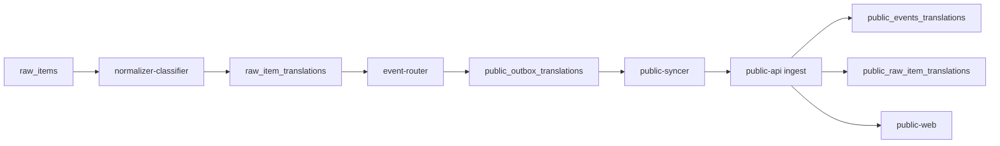

# Multilingual Translation Configuration Implementation Plan

Status: 混合的歷史計畫與後續提案。多個 row-based translation migrations 與 runtime 路徑已存在；本文件不是 live migration 狀態的證據。下方 2026-09-07 的 retirement review 取代先前「無限期保留 legacy 欄位」的指引。未授權任何開發或部署。


目標：把目前固定輸出 `zh-Hant` 與 `en` 的翻譯流程改成可由 `.env` 配置的多語言輸出。近期目標語言為 Traditional Chinese、English、Thai、Japanese；後續可新增更多 BCP 47 language code，而不需要新增 DB 欄位或大幅重寫 public sync contract。

## 1. Current State

目前資料流已經部分具備多語能力：



已具備的能力：

- `raw_item_translations` 是 row-based language table，已適合擴展到 `th`、`ja` 等語言。
- `public_outbox_translations` 是 row-based language table，已適合同步任意語言。
- `public-syncer` payload 已包含 `translations` array，並可保留非 `zh-Hant/en` rows。
- `public-api` ingest model 已接受 BCP-47-like language code，例如 `ja`、`fr`。
- `public-web` content localization type 是 `Language = string`，理論上可讀任意 translation row。

主要瓶頸：

- `normalizer-classifier` prompt 與 DB helper 仍 hardcode `zh-Hant` / `en`。
- `event-router` 建立 public outbox 時只使用 `zh-Hant` / `en`。
- `event-router`、`alert-dispatcher`、部分 dashboard query helper 仍用固定 `tr_zh` / `tr_en` join。
- `public-api` fallback / sort priority 仍偏向 hardcoded `en` / `zh-Hant`。
- `public-web` UI routes、language switcher、dictionary 目前只支援 `en` / `zh-Hant`。

## 2. Design Principles

1. Keep one model API call per raw item translation pass

   仍沿用目前「一次 translation API call 產生多個語言」的模式。這會增加 output tokens，也會增加 response validation 失敗時的 retry 成本，但可避免每個語言各打一通 API 造成 latency、rate limit 與多次 source-text token 重複成本。

2. Make language keys configurable, not schema-expanding

   不新增 `summary_th`、`summary_ja`、`full_translation_th`、`full_translation_ja` 這類欄位。新增語言應寫入 row-based tables：

   - `raw_item_translations(language, summary, full_translation, ...)`
   - `public_outbox_translations(language, title, summary, ...)`
   - `public_events_translations(language, title, summary, ...)`
   - `public_raw_item_translations(language, summary, full_translation, ...)`

   既有 `summary_zh`、`summary_en`、`full_translation_zh`、`full_translation_en` 保留為 legacy fast fields / fallback fields。

3. Use BCP 47 language codes

   建議初始值：

   ```text
   zh-Hant,en,th,ja
   ```

   不建議使用 `zh` 表示繁中，避免未來簡中或其他中文變體混淆。

4. Separate content language from UI language

   Content translations 可先支援 `th` / `ja`，但 public-web UI 是否提供 `/th/...`、`/ja/...` routes 取決於 UI dictionary 是否完成。避免只翻譯 event content，卻讓 nav/filter/footer 仍顯示英文而造成產品體驗不一致。

5. Keep channel boundaries

   `public_outbox_translations` 是 website/API display content，不應自動取代 Telegram 或 X publisher 文案。Telegram/X 仍應使用 channel-specific content 或未來新增 channel-aware translation table。

## 3. Proposed Environment Contract

### HomeLab `normalizer-classifier`

在 `infra/.env.example` 與 `infra/docker-compose.prod.yml` 加入：

```env
# Ordered list of target languages generated by the translation model.
TRANSLATION_OUTPUT_LANGUAGES=zh-Hant,en,th,ja

# Optional labels used only for prompt clarity. Keys must match TRANSLATION_OUTPUT_LANGUAGES.
TRANSLATION_LANGUAGE_LABELS_JSON={"zh-Hant":"Traditional Chinese","en":"English","th":"Thai","ja":"Japanese"}

# Optional: require every configured language before marking the raw item completed.
TRANSLATION_REQUIRE_ALL_LANGUAGES=true
```

Behavior（行為）：

- `TRANSLATION_OUTPUT_LANGUAGES` 是 model output 的權威清單。
- 順序有意義。用於 prompt 順序、顯示優先級提示與 validation 訊息。
- 空值或無效配置為了向後相容 fallback 到 `zh-Hant,en`。
- 對 language codes 去重並保留首次出現順序。
- 使用與 `public-api` 相同的 BCP-47-like regex 驗證 language codes。

### HomeLab `event-router`

新增：

```env
# Ordered list of languages eligible for website/API public outbox rows.
PUBLIC_OUTBOX_LANGUAGES=zh-Hant,en,th,ja

# Language to use for legacy public_title_* / public_summary_* fallback behavior.
PUBLIC_OUTBOX_DEFAULT_LANGUAGE=en
```

Behavior（行為）：

- `PUBLIC_OUTBOX_LANGUAGES` 控制哪些 `raw_item_translations` rows 變成 `public_outbox_translations`。
- 它可以等於 `TRANSLATION_OUTPUT_LANGUAGES`，也可以是其子集。
- title 與 summary 都缺失的語言不得放進 outbox。

### HomeLab `public-syncer`

可選，但建議：

```env
# Optional publish allowlist. Blank means sync all approved public_outbox translation rows.
PUBLIC_SYNC_LANGUAGES=zh-Hant,en,th,ja

# Optional raw feed allowlist. Blank means sync all completed raw_item translation rows.
PUBLIC_RAW_SYNC_LANGUAGES=zh-Hant,en,th,ja
```

Behavior（行為）：

- 留空表示目前行為：同步所有 present 且 approved/completed 的 rows。
- 設定後，payload `translations` arrays 只過濾到這些語言。
- 這提供了運維控制：當新產生的語言還在 QA 階段時可先保持內部。

### VPS `public-api`

在 `infra/xauusd-public-api.env.example` 與 public-api compose 加入：

```env
PUBLIC_DEFAULT_LANGUAGE=en
PUBLIC_LANGUAGE_PRIORITY=en,zh-Hant,th,ja
```

Behavior（行為）：

- `PUBLIC_DEFAULT_LANGUAGE` 取代 hardcoded 的 `DEFAULT_PUBLIC_LANGUAGE`。
- `PUBLIC_LANGUAGE_PRIORITY` 控制 sorting 與 fallback 順序。
- 若請求的 `lang` 不可用，fallback 應依序：
  1. requested language 有內容時使用它
  2. `PUBLIC_DEFAULT_LANGUAGE`
  3. `PUBLIC_LANGUAGE_PRIORITY` 中第一個有內容的語言
  4. 第一個有內容的 translation row

### Public Web

針對 build-time UI 支援：

```env
PUBLIC_WEB_UI_LANGUAGES=en,zh-Hant,th,ja
PUBLIC_WEB_DEFAULT_LANGUAGE=en
```

若 UI 語言清單維持 code-defined，這部分可選。若希望 env-driven UI routes，web app 仍必須為每個啟用的 UI 語言附上 dictionaries。

## 4. Data Model Changes

### Required

儲存 Thai/Japanese 內容不需要 production DB migration，因為目前 row-based translation tables 已支援任意 language codes。

### Legacy Dual-Write Policy

以 row-based translation tables 作為多語內容的可擴展 source of truth：

- `raw_item_translations`
- `public_outbox_translations`
- `public_events_translations`
- `public_raw_item_translations`

為向後相容，繼續寫入 legacy 欄位：

- `zh-Hant` rows 持續填入 `summary_zh` 與 `full_translation_zh`。
- `en` rows 持續填入 `summary_en` 與 `full_translation_en`。
- public event legacy 欄位持續填入 `public_title_zh`、`public_summary_zh`、`public_title_en` 與 `public_summary_en`。

新語言不得新增 per-language legacy 欄位。Thai、Japanese 與未來語言只能以 translation rows 儲存。Read paths 應逐步優先讀 row-based translations，legacy 欄位僅作為既有 `zh-Hant` / `en` 資料的 fallback。

### Optional Migration For Title Translations

目前 raw translation result 的形狀為：

```json
{
  "language": "ja",
  "summary": "...",
  "full_translation": "..."
}
```

Public event translation rows 需要：

```json
{
  "language": "ja",
  "title": "...",
  "summary": "..."
}
```

若 Japanese/Thai event cards 需要在地化 title，為 raw item translations 加入 title 支援：

```sql
alter table raw_item_translations
  add column if not exists title text;

create index if not exists raw_item_translations_title_trgm_idx
  on raw_item_translations using gin (title gin_trgm_ops);
```

接著更新：

- `AuxiliaryTranslation`
- `raw_item_translation_rows_for_result()`
- `_upsert_raw_item_translation()`
- `raw_item_translations_select_sql()`
- 若 raw feed 要曝露在地化 title，則包含 public raw item ingest/payload

若初期想避免 migration，Thai/Japanese public event titles 可在 summaries/full translations 已在地化的情況下，fallback 到原始 title 或英文 title。

建議：若 UI 品質重要，title translations 應在同一個專案內實作。否則 Thai/Japanese cards 會呈現部分在地化的觀感。

## 5. Service-by-Service Implementation

### 5.1 Shared Language Config Helpers

先新增小型 local helper modules，而不是立刻引入跨服務 package。

建議的 utility 行為：

```python
LANGUAGE_CODE_RE = re.compile(r"^[A-Za-z]{2,3}(?:-[A-Za-z0-9]{2,8})*$")

def parse_language_list(raw: str | None, *, default: tuple[str, ...]) -> tuple[str, ...]:
    ...
```

Rules（規則）：

- 以逗號分隔。
- Trim 空白。
- 拒絕空值。
- 驗證 BCP-47-like code。
- 去重並保留順序。
- 最終清單為空時回傳 default。

用於：

- `normalizer-classifier.settings`
- `event-router.settings`
- `public-syncer.settings`
- `public-api.settings`

### 5.2 `normalizer-classifier`

檔案：

- `services/normalizer-classifier/src/normalizer_classifier/settings.py`
- `services/normalizer-classifier/src/normalizer_classifier/model_client.py`
- `services/normalizer-classifier/src/normalizer_classifier/models.py`
- `services/normalizer-classifier/src/normalizer_classifier/db.py`
- `services/normalizer-classifier/tests/` 下的測試

Changes（變更）：

1. 新增 settings：

   ```python
   translation_output_languages_raw: str = Field(default="zh-Hant,en", alias="TRANSLATION_OUTPUT_LANGUAGES")
   translation_language_labels_json: str | None = Field(default=None, alias="TRANSLATION_LANGUAGE_LABELS_JSON")
   translation_require_all_languages: bool = Field(default=True, alias="TRANSLATION_REQUIRE_ALL_LANGUAGES")
   ```

   曝露 properties：

   - `translation_output_languages: tuple[str, ...]`
   - `translation_language_labels: dict[str, str]`

2. 更新 prompt 建構。

   目前 prompt 寫著：

   ```text
   Currently include zh-Hant and en.
   ```

   改為動態語言指令：

   ```text
   Return exactly one translation object for each configured target language:
   - zh-Hant: Traditional Chinese
   - en: English
   - th: Thai
   - ja: Japanese
   ```

   加入 per-language 約束：

   - `zh-Hant`：繁體中文，concise summary <= 280 個中文字。
   - `en`：英文，concise summary <= 400 個英文字元。
   - `th`：泰文，concise summary，保留 names/numbers/dates。
   - `ja`：日文，concise summary，保留 names/numbers/dates。
   - 對未知未來語言提供 generic fallback。

3. 將 target languages 傳入 `summarize_and_translate()`。

   `worker._run_translation_summary()` 應呼叫：

   ```python
   client.summarize_and_translate(..., target_languages=self.settings.translation_output_languages, language_labels=...)
   ```

4. 更新 JSON schema。

   目前 schema 有 `minItems: 2`、`maxItems: 8`。修改：

   - `TRANSLATION_REQUIRE_ALL_LANGUAGES=true` 時 `minItems = len(target_languages)`
   - `maxItems = max(len(target_languages), 8)`；嚴格模式下為 `len(target_languages)`

   在 model response 之後加入更強的 validation，因為單靠 JSON schema 無法確保精確的配置語言覆蓋。

5. 驗證 model output 覆蓋率。

   新增 helper：

   ```python
   def validate_auxiliary_translations(result, target_languages, require_all):
       ...
   ```

   Behavior（行為）：

   - 依配置精確 normalize language codes。
   - 若出現重複語言，保留第一筆或失敗；建議失敗以捕捉 model drift。
   - 若缺少必需語言且 `translation_require_all_languages=true`，raise `ModelClientError`。
   - 若為 `false`，允許部分結果並將 aggregate status 標記為 `partial_completed`。

6. 更新 legacy 欄位填入。

   `summary_zh`、`summary_en`、`full_translation_zh`、`full_translation_en` 僅由 `zh-Hant` 與 `en` rows 填入。

7. 更新 `raw_item_translation_rows_for_result()`。

   目前函式在迭代 result rows 之前先 append `zh-Hant` / `en`。改為：

   - 依序迭代配置的語言
   - 查找對應的 result translation
   - upsert 每個配置的語言
   - 可選：僅在已配置時才包含 model 額外回傳的語言

8. 更新 skip / fail 行為。

   `update_translation_skipped()` 與 `update_translation_failed()` 目前為 `DEFAULT_RAW_ITEM_TRANSLATION_LANGUAGES` 寫入 status rows。改為 settings-driven 的 target languages。

   由於這些 methods 目前不接收 settings，可二選一：

   - 將 `translation_output_languages` 存在 `Database` 上，或
   - 由 worker 將 languages 傳入每個 method。

   建議明確傳入 languages，讓 `Database` 較少 stateful。

Tests（測試）：

- settings 解析 default `("zh-Hant", "en")`
- settings 解析 `zh-Hant,en,th,ja`
- 無效值依所選 policy fallback 或 raise
- prompt 包含每個配置語言
- 含四種語言的 model result 可解析
- `TRANSLATION_REQUIRE_ALL_LANGUAGES=true` 時缺少 `ja` 會 raise
- 為 false 時缺少 `ja` 儲存 partial（若實作 partial 模式）
- skipped/failed 為所有配置語言寫入 rows
- legacy 欄位仍為 `zh-Hant` 與 `en` 填入

### 5.3 `event-router`

檔案：

- `services/event-router/src/event_router/settings.py`
- `services/event-router/src/event_router/raw_item_translation_sql.py`
- `services/event-router/src/event_router/db.py`
- `services/event-router/src/event_router/models.py`
- `services/event-router/src/event_router/policy.py`
- `services/event-router/tests/` 下的測試

Current limitation（現有限制）：

- `raw_item_translation_sql.py` 只 join `tr_zh` 與 `tr_en`。
- `PublicOutboxDraft` 只有 legacy `public_title_zh/public_title_en` 加上 generic `translations`。
- `public_outbox_translations()` 只建立兩筆 rows。

Changes（變更）：

1. 新增 settings：

   ```python
   public_outbox_languages_raw: str = Field(default="zh-Hant,en", alias="PUBLIC_OUTBOX_LANGUAGES")
   public_outbox_default_language: str = Field(default="en", alias="PUBLIC_OUTBOX_DEFAULT_LANGUAGE")
   ```

2. 以 JSON 查詢 translation rows。

   不再只用：

   ```sql
   left join raw_item_translations tr_zh ...
   left join raw_item_translations tr_en ...
   ```

   加入 JSON aggregation：

   ```sql
   coalesce(
     (
       select jsonb_agg(
         jsonb_build_object(
           'language', rit.language,
           'title', rit.title,
           'summary', rit.summary,
           'full_translation', rit.full_translation,
           'status', rit.status
         )
         order by rit.language
       )
       from raw_item_translations rit
       where rit.raw_item_id = r.id
         and rit.status in ('completed', 'completed_truncated')
     ),
     '[]'::jsonb
   ) as raw_item_translations
   ```

   在 alert/dashboard paths 更新前，保留既有 `raw_item_summary_zh` / `raw_item_summary_en` 欄位以維持向後相容。

3. 擴展 `RawItemContext`。

   加入：

   ```python
   translations: list[RawItemTranslationContext] = Field(default_factory=list)
   ```

   包含 `language`、optional `title`、`summary`、`full_translation`、`status`。

4. 依配置語言建立 outbox translations。

   將 `public_outbox_translations(zh_title, zh_summary, en_title, en_summary)` 取代為：

   ```python
   public_outbox_translations(event, languages=settings.public_outbox_languages)
   ```

   對每個語言：

   - Title:
     - 若 title migration 存在，使用 `raw_item_translations[language].title`
     - 否則僅對 `en` 使用 English/original title
     - 否則保留 null
   - Summary:
     - 使用 `raw_item_translations[language].summary`
     - 對既有欄位 fallback 到 legacy `summary_zh` / `summary_en`

5. 維護 legacy public 欄位。

   - `public_title_zh` / `public_summary_zh`：持續由 `zh-Hant` 填入。
   - `public_title_en` / `public_summary_en`：持續由 `en` 填入。
   - Thai/Japanese 只存在於 `public_outbox_translations`。

6. 不影響 Telegram/X publisher。

   既有文檔明確指出 Telegram/X 不得消費 website/API translations。維持該邊界。

Tests（測試）：

- `PUBLIC_OUTBOX_LANGUAGES=zh-Hant,en,th,ja` 在 summaries 存在時建立四筆 public outbox translation rows。
- 缺少 `ja` summary 不建立空 row。
- legacy 欄位仍與 `zh-Hant`、`en` 相符。
- `public_outbox` upsert 仍 insert/update translation rows。
- 既有 Telegram/X 測試維持不變。

### 5.4 `public-syncer`

檔案：

- `services/public-syncer/src/public_syncer/settings.py`
- `services/public-syncer/src/public_syncer/payload.py`
- `services/public-syncer/src/public_syncer/db.py`
- `services/public-syncer/tests/` 下的測試

Changes（變更）：

1. 新增可選 language allowlists：

   ```python
   public_sync_languages_raw: str | None = Field(default=None, alias="PUBLIC_SYNC_LANGUAGES")
   public_raw_sync_languages_raw: str | None = Field(default=None, alias="PUBLIC_RAW_SYNC_LANGUAGES")
   ```

2. 若配置了 allowlist，過濾 payload translations。

   Event payload：

   - 過濾 `item.translations`
   - 僅在語言被允許時才 fallback legacy rows

   Raw payload：

   - 過濾 `item.translations`
   - 為向後相容保留 legacy `summary_zh`、`summary_en`、`full_translation_zh`、`full_translation_en`

3. 預設同步所有 rows。

   為維持目前行為，allowlist 留空表示不過濾。

Tests（測試）：

- default payload 保留 `ja` / `th` rows
- allowlist 排除未列出的語言
- fallback legacy rows 遵守 allowlist
- raw item translations 保留所有 completed 的配置 rows

### 5.5 `public-api`

檔案：

- `services/public-api/src/public_api/settings.py`
- `services/public-api/src/public_api/db.py`
- `services/public-api/tests/` 下的測試

Changes（變更）：

1. 新增 settings：

   ```python
   public_default_language: str = Field(default="en", alias="PUBLIC_DEFAULT_LANGUAGE")
   public_language_priority_raw: str = Field(default="en,zh-Hant", alias="PUBLIC_LANGUAGE_PRIORITY")
   ```

2. 在 request-time settings 有影響之處取代 module constants。

   目前的 module constants：

   - `DEFAULT_PUBLIC_LANGUAGE = "en"`
   - `PUBLIC_LANGUAGE_ZH_HANT = "zh-Hant"`
   - `PUBLIC_LANGUAGE_EN = "en"`

   legacy constants 僅保留給 legacy field mapping；default 與 priority 移入 `PublicRepository`。

3. 更新 `normalize_public_language()`。

   讓它接受 default language：

   ```python
   normalize_public_language(lang, default_language)
   ```

4. 更新語言選擇。

   將：

   ```python
   requested -> en -> first available
   ```

   改為：

   ```python
   requested -> public_default_language -> public_language_priority order -> first available
   ```

5. 更新排序。

   將 `_language_sort_key()` 的 hardcode 取代為來自 settings 的 priority map。

6. 保持 ingest 彈性。

   `translations` 不需要 ingest schema 變更。

Tests（測試）：

- default 行為維持 `en`、`zh-Hant`
- priority `en,zh-Hant,th,ja` 依此排序
- 請求 `ja` 且存在時回傳日文
- 請求 `th` 但缺泰文時 fallback 到英文
- 缺英文時 fallback 到第一個有內容的配置 priority 語言
- ingest 仍接受任意有效語言

### 5.6 `public-web`

檔案：

- `apps/public-web/src/i18n/index.ts`
- `apps/public-web/src/api/localization.ts`
- `apps/public-web/src/components/Layout.tsx`
- `apps/public-web/src/main.tsx`

Changes（變更）：

1. 決定 UI 是否立即支援 Thai/Japanese。

   Option A：先只支援 content

   - 維持 `supportedLanguages = ["en", "zh-Hant"]`。
   - Public API 仍可在外部以 URL `?lang=ja` 回傳 `ja`/`th`，但 app 不曝露 `/ja/...` routes。
   - 實作成本較低，但不是 Thai/Japanese 的完整產品上線。

   Option B：完整 UI 支援

   - 將 `th`、`ja` 加入 `UiLanguage`。
   - 加入語言 labels：

     ```ts
     th: "ไทย"
     ja: "日本語"
     ```

   - 為所有 nav/filter/page/status/footer 字串加入 dictionaries。
   - 更新 `isLanguage()`。

   建議：若 Thai/Japanese 是面向使用者的需求，選 Option B。

2. 維持 content localization 的通用性。

   `apps/public-web/src/api/localization.ts` 已接受任意 `Language = string`。只在需要時更新 sort priority：

   ```ts
   const contentLanguagePriority = ["en", "zh-Hant", "th", "ja"];
   ```

3. 確認 API request 以 `lang` 傳遞 route 語言。

   既有頁面使用 `useLanguage()` 並將 `lang` 傳入 event/raw item APIs。加入 `th`/`ja` UI routes 後，content language 將跟隨 route 語言。

Tests（測試）：

- `/ja/events` route 可被接受
- language switcher 包含日文與泰文
- event card 使用存在的日文/泰文 translation row
- 缺日文翻譯時 fallback 到英文
- TypeScript build 通過

### 5.7 Dashboard / Alert Dispatcher

Public API 多語同步不需要它們，但仍需檢視：

- `services/dashboard-api/src/dashboard_api/raw_item_translation_sql.py`
- `services/alert-dispatcher/src/alert_dispatcher/raw_item_translation_sql.py`

建議：

- 除非 alert channel 內容需要 Thai/Japanese，否則 alert dispatcher 維持不變。
- Dashboard 目前可保留 `zh-Hant/en` fast columns，但應在可用處曝露完整 `translations` JSON 供 debugging 與 QA。

## 6. Prompt And Token Budget Strategy

### Why One API Call Still Makes Sense

單次呼叫的多語言輸出只重複 source text 一次。若每個語言分開呼叫，每次呼叫都會重送：

- system prompt
- taxonomy context
- source metadata
- 完整 raw item text

這通常花費更多 input tokens 並增加 latency。單次呼叫花費更多 output tokens，但對 4-6 個語言而言通常更便宜且維運更簡單。

### Risk Controls

1. 限制語言數量

   加入 validation：

   ```text
   1 <= len(TRANSLATION_OUTPUT_LANGUAGES) <= 8
   ```

   語言數量超過 8 時再重新檢視。

2. 動態 max output 預期

   若 model provider 支援 `max_tokens`，依下列估算：

   ```text
   base_output + per_language_summary + per_language_full_translation
   ```

   目前 client 未明確設定 `max_tokens`；僅在 provider/model 開始不可預期地截斷 response 時才加入。

3. 嚴格 validation

   若 `TRANSLATION_REQUIRE_ALL_LANGUAGES=true`，缺少任一配置語言應觸發 fallback model 或 retry，而不是靜默標記 completed。

4. 為韌性提供 partial 模式

   若 production 成本過高，可允許：

   ```env
   TRANSLATION_REQUIRE_ALL_LANGUAGES=false
   ```

   然後儲存可用的 rows 並將 aggregate 標記為 `partial_completed`。

5. Observability

   既有 `ai_model_calls` 已記錄 token usage 與估算成本。若可行，將語言數量與配置語言清單加入 usage metadata：

   ```json
   {
     "translation_languages": ["zh-Hant", "en", "th", "ja"],
     "translation_language_count": 4
   }
   ```

## 7. Deployment Plan

### Phase 1: Config Parsing And Normalizer Output

範圍：

- `normalizer-classifier`
- `infra/.env.example`
- `infra/docker-compose.prod.yml`

Steps（步驟）：

1. 加入 env vars 與 settings 解析。
2. 由配置語言產生 prompt。
3. 驗證 model output 包含配置語言。
4. 將配置語言 rows 存入 `raw_item_translations`。
5. 為 `zh-Hant` / `en` 保留 legacy 欄位。
6. 執行 service unit tests。

Verification（驗證）：

```bash
services/normalizer-classifier/.venv/bin/python -m pytest services/normalizer-classifier/tests
```

Local DB spot checks（本機 DB 抽查）：

```sql
select language, count(*)
from raw_item_translations
group by 1
order by 1;
```

實際處理後預期：

```text
en
ja
th
zh-Hant
```

### Phase 2: Event Router Public Outbox

範圍：

- `event-router`
- `public_outbox_translations`

Steps（步驟）：

1. 加入 `PUBLIC_OUTBOX_LANGUAGES`。
2. 以 JSON 查詢 raw item translation rows。
3. 為配置語言建立 public outbox translations。
4. 保留 legacy `public_title_*` 與 `public_summary_*` 行為。
5. 執行 event-router 測試。

Verification（驗證）：

```bash
services/event-router/.venv/bin/python -m pytest services/event-router/tests
```

DB spot checks:

```sql
select language, count(*)
from public_outbox_translations
group by 1
order by 1;
```

### Phase 3: Public Syncer Filtering And Payload QA

範圍：

- `public-syncer`

Steps（步驟）：

1. 加入可選 sync language allowlists。
2. 確保 payload 預設保留 `th` 與 `ja` rows。
3. 為 allowlist 行為加入測試。
4. 執行 syncer 測試。

Verification（驗證）：

```bash
services/public-syncer/.venv/bin/python -m pytest services/public-syncer/tests
```

Dry-run payload QA：

- 啟用 `PUBLIC_SYNCER_DRY_RUN=true`。
- 檢查 logs 中 payload `translations` 的語言清單。
- 確認沒有 secrets / raw private fields 被 log 或同步。

### Phase 4: Public API Fallback And Sort Priority

範圍：

- `public-api`
- VPS env example / compose

Steps（步驟）：

1. 加入 `PUBLIC_DEFAULT_LANGUAGE`。
2. 加入 `PUBLIC_LANGUAGE_PRIORITY`。
3. 讓 shape / fallback 函式使用 repository settings。
4. 執行 public-api 測試。

Verification（驗證）：

```bash
services/public-api/.venv/bin/python -m pytest services/public-api/tests
```

部署後的 API 檢查：

```bash
curl -fsS 'https://news-api.thetickbase.com/events?page_size=1&lang=ja' | jq '.items[0] | {language, available_languages, title, summary}'
curl -fsS 'https://news-api.thetickbase.com/raw-items?page_size=1&lang=th' | jq '.items[0] | {language, available_languages, summary, full_translation}'
```

### Phase 5: Public Web UI

範圍：

- `apps/public-web`

Steps（步驟）：

1. 將 `th`、`ja` 加入 `UiLanguage`。
2. 加入 `th`、`ja` dictionaries。
3. 加入語言 labels。
4. 確認 `/th/events` 與 `/ja/events` routes 運作。
5. 執行 build。

Verification（驗證）：

```bash
cd apps/public-web
npm run build
```

Manual browser QA（手動瀏覽器 QA）：

- `/en/events`
- `/zh-Hant/events`
- `/th/events`
- `/ja/events`
- event detail
- raw item detail
- language switcher
- mobile nav

### Phase 6: Production Rollout

由於此變更涉及 production sync 與 public API 行為，須遵循整合部署護欄。

建議 rollout：

1. 部署 HomeLab normalizer 變更，並使用：

   ```env
   TRANSLATION_OUTPUT_LANGUAGES=zh-Hant,en
   ```

   先驗證無 regression。

2. 以同樣的雙語配置部署 event-router / public-syncer / public-api 變更。

3. 僅在 HomeLab 啟用 `th,ja`：

   ```env
   TRANSLATION_OUTPUT_LANGUAGES=zh-Hant,en,th,ja
   PUBLIC_OUTBOX_LANGUAGES=zh-Hant,en,th,ja
   PUBLIC_SYNCER_DRY_RUN=true
   ```

4. 驗證 DB rows 與 dry-run payloads。

5. 關閉 dry-run 並同步到 public-api。

6. 僅在 API 有真實內容後，才加入 public-web Thai/Japanese routes。

## 8. Backfill Strategy

除非觸發 backfill，新翻譯只為新處理或重新處理的 raw items 產生。

Options（選項）：

1. 不做歷史 backfill

   新語言只出現在新 feed items。成本最低且最安全。

2. 有限的近期 backfill

   將最近 N 小時 / 天的高價值 raw items 重新排入 queue：

   - severity S/A 關聯 items
   - relevant 的 public raw feed items
   - 選定的 source groups

3. 完整 backfill

   初期不建議。token 成本可能快速膨脹，且可能重新觸發大量 sync rows。

建議的初期做法：

- 只 backfill 最近 24-72 小時。
- 優先 `relevance_score >= 70`。
- backfill 期間維持 model call budget caps 開啟。

## 9. Test Matrix

### Unit Tests

執行：

```bash
services/normalizer-classifier/.venv/bin/python -m pytest services/normalizer-classifier/tests
services/event-router/.venv/bin/python -m pytest services/event-router/tests
services/public-syncer/.venv/bin/python -m pytest services/public-syncer/tests
services/public-api/.venv/bin/python -m pytest services/public-api/tests
```

### Integration Checks

HomeLab DB：

```sql
select language, status, count(*)
from raw_item_translations
group by 1, 2
order by 1, 2;

select language, status, count(*)
from public_outbox_translations
group by 1, 2
order by 1, 2;
```

VPS public DB：

```sql
select language, count(*)
from public_events_translations
group by 1
order by 1;

select language, count(*)
from public_raw_item_translations
group by 1
order by 1;
```

Public API：

```bash
curl -fsS 'https://news-api.thetickbase.com/events?page_size=1&lang=ja'
curl -fsS 'https://news-api.thetickbase.com/events?page_size=1&lang=th'
curl -fsS 'https://news-api.thetickbase.com/raw-items?page_size=1&lang=ja'
curl -fsS 'https://news-api.thetickbase.com/raw-items?page_size=1&lang=th'
```

預期 response 特性：

- translation 存在時，`language` 等於 requested language。
- `available_languages` 包含所有有內容的配置語言。
- `translations` 包含所有已同步的語言。
- 缺少的 requested language 依配置的 default/priority fallback。

## 10. Risks And Mitigations

| Risk（風險） | Impact（影響） | Mitigation（緩解） |
| --- | --- | --- |
| 更多 output tokens | AI 成本上升 | 維持單一 API call，監控 `ai_model_calls`，限制語言數量 |
| 模型遺漏配置語言 | 內容不完整 | 嚴格 validation + fallback model / retry |
| 模型回傳無效 language code | 壞 rows 或同步失敗 | 依配置語言清單驗證 |
| JSON response 過長 / 被截斷 | 解析失敗 | 維持合理的語言數量上限；考慮 provider `max_tokens` |
| public web route 先於 UI dictionary 存在 | 混合語言 UI | 啟用 `th/ja` routes 前先加入 UI dictionaries |
| 既有 alert/dashboard paths 假設兩種語言 | 非公開功能維持雙語 | 初期保留 legacy joins；之後加入 generic translations |
| Backfill 成本暴增 | API 支出 / rate limits | 從不做或有限 backfill 起步，設定 budgets |
| 既有 public event title 未在地化 | 部分在地化 | 為 `raw_item_translations` 加入 optional `title`，或接受 fallback |

## 11. Recommended Initial Scope

第一個實作 PR 應保持範圍可控：

1. 加入可配置的 `TRANSLATION_OUTPUT_LANGUAGES`。
2. 在 `raw_item_translations` 產生並儲存 `zh-Hant,en,th,ja`。
3. 加入可配置的 `PUBLIC_OUTBOX_LANGUAGES`。
4. 透過 `public_outbox_translations` -> `public-api` 同步 Thai/Japanese rows。
5. 加入 API fallback priority settings。
6. 在 Thai/Japanese dictionaries 完成前，public-web UI 語言維持 `en/zh-Hant`，除非產品要求立即公開上線。

第一個 PR 不做的事：

- 不修改 Telegram/X 輸出行為。
- 不執行完整歷史 backfill。
- 不新增 per-language 欄位。
- 不移除 legacy `summary_zh` / `summary_en` 欄位。

## 12. Acceptance Criteria

實作視為完成的條件：

- `.env` 可設定 `TRANSLATION_OUTPUT_LANGUAGES=zh-Hant,en,th,ja`。
- 新處理的 raw items 為 `zh-Hant`、`en`、`th`、`ja` 建立 `raw_item_translations` rows。
- Public website/API approved events 在有內容時為配置語言建立 `public_outbox_translations` rows。
- `public-syncer` 將所有配置的 translation rows 傳送到 `public-api`。
- `public-api` 持久化並回傳 Thai/Japanese translation rows。
- `GET /events?lang=ja` 與 `GET /events?lang=th` 在可用時回傳在地化內容。
- `GET /raw-items?lang=ja` 與 `GET /raw-items?lang=th` 在可用時回傳在地化 summary/full translation。
- 缺少語言的 fallback 是 deterministic 且有測試覆蓋。
- 既有 `en` 與 `zh-Hant` 行為維持向後相容。
- normalizer、event-router、public-syncer 與 public-api 的 unit tests 通過。


## 13. Legacy event-summary retirement (superseded planning location)

2026-09-07 使用者同意將此工作抽出為獨立 refactor，且必須在新的 News 實作之前完成。其範圍、目標 data model、migration、acceptance 與 rollback 現僅存在於
[standalone retirement plan](../../../docs/plans/2026-09-07-legacy-event-summary-retirement.md)。

本歷史文件中先前「無限期保留 legacy 欄位」的指示已被該計畫取代。此指標不是實作或部署證據。
