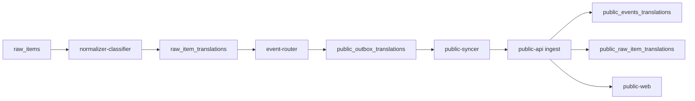

# Multilingual Translation Configuration Implementation Plan

Status: Mixed historical plan and proposed follow-up. Several row-based translation
migrations and runtime paths already exist; this document is not proof of live
migration state. The 2026-09-07 retirement review below supersedes earlier guidance
to retain legacy fields indefinitely. No development or deployment is authorized.


目標：把目前固定輸出 `zh-Hant` 與 `en` 的翻譯流程改成可由 `.env` 配置的多語言輸出。近期目標語言為 Traditional Chinese、English、Thai、Japanese；後續可新增更多 BCP 47 language code，而不需要新增 DB 欄位或大幅重寫 public sync contract。

## 1. Current State

目前資料流已經部分具備多語能力：



已具備的能力：

- `raw_item_translations` 是 row-based language table，已適合擴展到 `th`、`ja` 等語言。
- `public_outbox_translations` 是 row-based language table，已適合同步任意語言。
- `public-syncer` payload 已包含 `translations` array，並可保留非 `zh-Hant/en` rows。
- `public-api` ingest model 已接受 BCP-47-like language code，例如 `ja`、`fr`。
- `public-web` content localization type 是 `Language = string`，理論上可讀任意 translation row。

主要瓶頸：

- `normalizer-classifier` prompt 與 DB helper 仍 hardcode `zh-Hant` / `en`。
- `event-router` 建立 public outbox 時只使用 `zh-Hant` / `en`。
- `event-router`、`alert-dispatcher`、部分 dashboard query helper 仍用固定 `tr_zh` / `tr_en` join。
- `public-api` fallback / sort priority 仍偏向 hardcoded `en` / `zh-Hant`。
- `public-web` UI routes、language switcher、dictionary 目前只支援 `en` / `zh-Hant`。

## 2. Design Principles

1. Keep one model API call per raw item translation pass

   仍沿用目前「一次 translation API call 產生多個語言」的模式。這會增加 output tokens，也會增加 response validation 失敗時的 retry 成本，但可避免每個語言各打一通 API 造成 latency、rate limit 與多次 source-text token 重複成本。

2. Make language keys configurable, not schema-expanding

   不新增 `summary_th`、`summary_ja`、`full_translation_th`、`full_translation_ja` 這類欄位。新增語言應寫入 row-based tables：

   - `raw_item_translations(language, summary, full_translation, ...)`
   - `public_outbox_translations(language, title, summary, ...)`
   - `public_events_translations(language, title, summary, ...)`
   - `public_raw_item_translations(language, summary, full_translation, ...)`

   既有 `summary_zh`、`summary_en`、`full_translation_zh`、`full_translation_en` 保留為 legacy fast fields / fallback fields。

3. Use BCP 47 language codes

   建議初始值：

   ```text
   zh-Hant,en,th,ja
   ```

   不建議使用 `zh` 表示繁中，避免未來簡中或其他中文變體混淆。

4. Separate content language from UI language

   Content translations 可先支援 `th` / `ja`，但 public-web UI 是否提供 `/th/...`、`/ja/...` routes 取決於 UI dictionary 是否完成。避免只翻譯 event content，卻讓 nav/filter/footer 仍顯示英文而造成產品體驗不一致。

5. Keep channel boundaries

   `public_outbox_translations` 是 website/API display content，不應自動取代 Telegram 或 X publisher 文案。Telegram/X 仍應使用 channel-specific content 或未來新增 channel-aware translation table。

## 3. Proposed Environment Contract

### HomeLab `normalizer-classifier`

Add to `infra/.env.example` and `infra/docker-compose.prod.yml`:

```env
# Ordered list of target languages generated by the translation model.
TRANSLATION_OUTPUT_LANGUAGES=zh-Hant,en,th,ja

# Optional labels used only for prompt clarity. Keys must match TRANSLATION_OUTPUT_LANGUAGES.
TRANSLATION_LANGUAGE_LABELS_JSON={"zh-Hant":"Traditional Chinese","en":"English","th":"Thai","ja":"Japanese"}

# Optional: require every configured language before marking the raw item completed.
TRANSLATION_REQUIRE_ALL_LANGUAGES=true
```

Behavior:

- `TRANSLATION_OUTPUT_LANGUAGES` is the authoritative list for model output.
- Order matters. Use it for prompt order, display priority hints, and validation messages.
- Empty or invalid config falls back to `zh-Hant,en` for backward compatibility.
- Deduplicate language codes while preserving first occurrence.
- Validate language codes with the same BCP-47-like regex used by `public-api`.

### HomeLab `event-router`

Add:

```env
# Ordered list of languages eligible for website/API public outbox rows.
PUBLIC_OUTBOX_LANGUAGES=zh-Hant,en,th,ja

# Language to use for legacy public_title_* / public_summary_* fallback behavior.
PUBLIC_OUTBOX_DEFAULT_LANGUAGE=en
```

Behavior:

- `PUBLIC_OUTBOX_LANGUAGES` controls which `raw_item_translations` rows become `public_outbox_translations`.
- It can be equal to, or a subset of, `TRANSLATION_OUTPUT_LANGUAGES`.
- Do not include a language in outbox if title and summary are both missing.

### HomeLab `public-syncer`

Optional, but recommended:

```env
# Optional publish allowlist. Blank means sync all approved public_outbox translation rows.
PUBLIC_SYNC_LANGUAGES=zh-Hant,en,th,ja

# Optional raw feed allowlist. Blank means sync all completed raw_item translation rows.
PUBLIC_RAW_SYNC_LANGUAGES=zh-Hant,en,th,ja
```

Behavior:

- Blank means current behavior: sync whatever rows are present and approved/completed.
- When configured, filter payload `translations` arrays to these languages only.
- This gives operational control if a newly generated language should stay internal during QA.

### VPS `public-api`

Add to `infra/xauusd-public-api.env.example` and public-api compose:

```env
PUBLIC_DEFAULT_LANGUAGE=en
PUBLIC_LANGUAGE_PRIORITY=en,zh-Hant,th,ja
```

Behavior:

- `PUBLIC_DEFAULT_LANGUAGE` replaces hardcoded `DEFAULT_PUBLIC_LANGUAGE`.
- `PUBLIC_LANGUAGE_PRIORITY` controls sorting and fallback order.
- If requested `lang` is unavailable, fallback should use:
  1. requested language when content exists
  2. `PUBLIC_DEFAULT_LANGUAGE`
  3. first language in `PUBLIC_LANGUAGE_PRIORITY` that has content
  4. first available translation row with content

### Public Web

For build-time UI support:

```env
PUBLIC_WEB_UI_LANGUAGES=en,zh-Hant,th,ja
PUBLIC_WEB_DEFAULT_LANGUAGE=en
```

This is optional if UI language list remains code-defined. If env-driven UI routes are desired, the web app must still ship dictionaries for each enabled UI language.

## 4. Data Model Changes

### Required

No production DB migration is required to store Thai/Japanese content, because current row-based translation tables already support arbitrary language codes.

### Legacy Dual-Write Policy

Use row-based translation tables as the expandable source of truth for multilingual content:

- `raw_item_translations`
- `public_outbox_translations`
- `public_events_translations`
- `public_raw_item_translations`

Continue writing legacy columns only for backward compatibility:

- `zh-Hant` rows continue to populate `summary_zh` and `full_translation_zh`.
- `en` rows continue to populate `summary_en` and `full_translation_en`.
- public event legacy columns continue to populate `public_title_zh`, `public_summary_zh`, `public_title_en`, and `public_summary_en`.

Do not add per-language legacy columns for new languages. Thai, Japanese, and future languages must be stored only as translation rows. Read paths should gradually move to row-based translations first, with legacy columns used only as fallback for existing `zh-Hant` / `en` data.

### Optional Migration For Title Translations

Current raw translation result shape has:

```json
{
  "language": "ja",
  "summary": "...",
  "full_translation": "..."
}
```

Public event translation rows need:

```json
{
  "language": "ja",
  "title": "...",
  "summary": "..."
}
```

If Japanese/Thai event cards must have localized titles, add title support to raw item translations:

```sql
alter table raw_item_translations
  add column if not exists title text;

create index if not exists raw_item_translations_title_trgm_idx
  on raw_item_translations using gin (title gin_trgm_ops);
```

Then update:

- `AuxiliaryTranslation`
- `raw_item_translation_rows_for_result()`
- `_upsert_raw_item_translation()`
- `raw_item_translations_select_sql()`
- public raw item ingest/payload if raw feed should expose translated titles

If avoiding a migration initially, Thai/Japanese public event titles can fallback to original or English title while summaries/full translations are localized.

Recommendation: implement title translations in the same project if UI quality matters. Otherwise Thai/Japanese cards will look partially localized.

## 5. Service-by-Service Implementation

### 5.1 Shared Language Config Helpers

Add small local helper modules rather than introducing a cross-service package immediately.

Suggested utility behavior:

```python
LANGUAGE_CODE_RE = re.compile(r"^[A-Za-z]{2,3}(?:-[A-Za-z0-9]{2,8})*$")

def parse_language_list(raw: str | None, *, default: tuple[str, ...]) -> tuple[str, ...]:
    ...
```

Rules:

- Split on comma.
- Trim whitespace.
- Reject empty values.
- Validate BCP-47-like code.
- Deduplicate while preserving order.
- If final list is empty, return default.

Use this in:

- `normalizer-classifier.settings`
- `event-router.settings`
- `public-syncer.settings`
- `public-api.settings`

### 5.2 `normalizer-classifier`

Files:

- `services/normalizer-classifier/src/normalizer_classifier/settings.py`
- `services/normalizer-classifier/src/normalizer_classifier/model_client.py`
- `services/normalizer-classifier/src/normalizer_classifier/models.py`
- `services/normalizer-classifier/src/normalizer_classifier/db.py`
- tests under `services/normalizer-classifier/tests/`

Changes:

1. Add settings:

   ```python
   translation_output_languages_raw: str = Field(default="zh-Hant,en", alias="TRANSLATION_OUTPUT_LANGUAGES")
   translation_language_labels_json: str | None = Field(default=None, alias="TRANSLATION_LANGUAGE_LABELS_JSON")
   translation_require_all_languages: bool = Field(default=True, alias="TRANSLATION_REQUIRE_ALL_LANGUAGES")
   ```

   Expose properties:

   - `translation_output_languages: tuple[str, ...]`
   - `translation_language_labels: dict[str, str]`

2. Update prompt construction.

   Current prompt says:

   ```text
   Currently include zh-Hant and en.
   ```

   Replace with dynamic language instructions:

   ```text
   Return exactly one translation object for each configured target language:
   - zh-Hant: Traditional Chinese
   - en: English
   - th: Thai
   - ja: Japanese
   ```

   Add per-language constraints:

   - `zh-Hant`: Traditional Chinese, concise summary <= 280 Chinese characters.
   - `en`: English, concise summary <= 400 English characters.
   - `th`: Thai, concise summary, preserve names/numbers/dates.
   - `ja`: Japanese, concise summary, preserve names/numbers/dates.
   - Generic fallback for unknown future languages.

3. Pass target languages into `summarize_and_translate()`.

   `worker._run_translation_summary()` should call:

   ```python
   client.summarize_and_translate(..., target_languages=self.settings.translation_output_languages, language_labels=...)
   ```

4. Update JSON schema.

   Current schema has `minItems: 2`, `maxItems: 8`. Change:

   - `minItems = len(target_languages)` when `TRANSLATION_REQUIRE_ALL_LANGUAGES=true`
   - `maxItems = max(len(target_languages), 8)` or `len(target_languages)` if strict

   Add stronger validation after model response, because JSON schema alone cannot ensure exact configured language coverage.

5. Validate model output coverage.

   Add helper:

   ```python
   def validate_auxiliary_translations(result, target_languages, require_all):
       ...
   ```

   Behavior:

   - Normalize language codes exactly as configured.
   - If duplicate language appears, keep first or fail; prefer fail to catch model drift.
   - If required language missing and `translation_require_all_languages=true`, raise `ModelClientError`.
   - If `false`, allow partial result and mark aggregate status as `partial_completed`.

6. Update legacy field population.

   Keep `summary_zh`, `summary_en`, `full_translation_zh`, `full_translation_en` populated from `zh-Hant` and `en` rows only.

7. Update `raw_item_translation_rows_for_result()`.

   Current function appends `zh-Hant` / `en` before iterating result rows. Change it to:

   - iterate configured languages in order
   - lookup matching result translation
   - upsert each configured language
   - optionally include additional model-returned languages only if they are configured

8. Update skip/fail behavior.

   `update_translation_skipped()` and `update_translation_failed()` currently insert status rows for `DEFAULT_RAW_ITEM_TRANSLATION_LANGUAGES`. Replace with settings-driven target languages.

   Because these methods currently do not receive settings, either:

   - store `translation_output_languages` on `Database`, or
   - pass languages into each method from worker.

   Prefer passing languages explicitly to keep `Database` less stateful.

Tests:

- settings parse default `("zh-Hant", "en")`
- settings parse `zh-Hant,en,th,ja`
- invalid values fallback or raise according to chosen policy
- prompt includes every configured language
- model result with all four languages parses
- missing `ja` raises when `TRANSLATION_REQUIRE_ALL_LANGUAGES=true`
- missing `ja` stores partial when false, if partial mode is implemented
- skipped/failed writes rows for all configured languages
- legacy fields still populated for `zh-Hant` and `en`

### 5.3 `event-router`

Files:

- `services/event-router/src/event_router/settings.py`
- `services/event-router/src/event_router/raw_item_translation_sql.py`
- `services/event-router/src/event_router/db.py`
- `services/event-router/src/event_router/models.py`
- `services/event-router/src/event_router/policy.py`
- tests under `services/event-router/tests/`

Current limitation:

- `raw_item_translation_sql.py` only joins `tr_zh` and `tr_en`.
- `PublicOutboxDraft` only has legacy `public_title_zh/public_title_en` plus generic `translations`.
- `public_outbox_translations()` only creates two rows.

Changes:

1. Add settings:

   ```python
   public_outbox_languages_raw: str = Field(default="zh-Hant,en", alias="PUBLIC_OUTBOX_LANGUAGES")
   public_outbox_default_language: str = Field(default="en", alias="PUBLIC_OUTBOX_DEFAULT_LANGUAGE")
   ```

2. Query translation rows as JSON.

   Instead of only:

   ```sql
   left join raw_item_translations tr_zh ...
   left join raw_item_translations tr_en ...
   ```

   add a JSON aggregation:

   ```sql
   coalesce(
     (
       select jsonb_agg(
         jsonb_build_object(
           'language', rit.language,
           'title', rit.title,
           'summary', rit.summary,
           'full_translation', rit.full_translation,
           'status', rit.status
         )
         order by rit.language
       )
       from raw_item_translations rit
       where rit.raw_item_id = r.id
         and rit.status in ('completed', 'completed_truncated')
     ),
     '[]'::jsonb
   ) as raw_item_translations
   ```

   Keep existing `raw_item_summary_zh` / `raw_item_summary_en` fields for backward compatibility until alert/dashboard paths are updated.

3. Extend `RawItemContext`.

   Add:

   ```python
   translations: list[RawItemTranslationContext] = Field(default_factory=list)
   ```

   Include `language`, optional `title`, `summary`, `full_translation`, `status`.

4. Build outbox translations from configured languages.

   Replace `public_outbox_translations(zh_title, zh_summary, en_title, en_summary)` with:

   ```python
   public_outbox_translations(event, languages=settings.public_outbox_languages)
   ```

   For each language:

   - Title:
     - use `raw_item_translations[language].title` if title migration exists
     - else use English/original title only for `en`
     - else leave null
   - Summary:
     - use `raw_item_translations[language].summary`
     - fallback to legacy `summary_zh` / `summary_en` for existing fields

5. Maintain legacy public columns.

   - `public_title_zh` / `public_summary_zh`: continue from `zh-Hant`.
   - `public_title_en` / `public_summary_en`: continue from `en`.
   - Thai/Japanese should only live in `public_outbox_translations`.

6. Do not affect Telegram/X publisher.

   Existing docs explicitly say Telegram/X should not consume website/API translations. Keep that boundary.

Tests:

- `PUBLIC_OUTBOX_LANGUAGES=zh-Hant,en,th,ja` creates four public outbox translation rows when summaries exist.
- Missing `ja` summary does not create empty row.
- Legacy fields still match `zh-Hant` and `en`.
- `public_outbox` upsert still inserts/updates translation rows.
- Existing Telegram/X tests remain unchanged.

### 5.4 `public-syncer`

Files:

- `services/public-syncer/src/public_syncer/settings.py`
- `services/public-syncer/src/public_syncer/payload.py`
- `services/public-syncer/src/public_syncer/db.py`
- tests under `services/public-syncer/tests/`

Changes:

1. Add optional language allowlists:

   ```python
   public_sync_languages_raw: str | None = Field(default=None, alias="PUBLIC_SYNC_LANGUAGES")
   public_raw_sync_languages_raw: str | None = Field(default=None, alias="PUBLIC_RAW_SYNC_LANGUAGES")
   ```

2. Filter payload translations if allowlist is configured.

   Event payload:

   - filter `item.translations`
   - fallback legacy rows only if language is allowed

   Raw payload:

   - filter `item.translations`
   - keep legacy `summary_zh`, `summary_en`, `full_translation_zh`, `full_translation_en` for backward compatibility

3. Keep sync all rows by default.

   To preserve current behavior, blank allowlist means no filtering.

Tests:

- default payload preserves `ja` / `th` rows
- allowlist excludes non-listed language
- fallback legacy rows respect allowlist
- raw item translations preserve all completed configured rows

### 5.5 `public-api`

Files:

- `services/public-api/src/public_api/settings.py`
- `services/public-api/src/public_api/db.py`
- tests under `services/public-api/tests/`

Changes:

1. Add settings:

   ```python
   public_default_language: str = Field(default="en", alias="PUBLIC_DEFAULT_LANGUAGE")
   public_language_priority_raw: str = Field(default="en,zh-Hant", alias="PUBLIC_LANGUAGE_PRIORITY")
   ```

2. Replace module constants where request-time settings matter.

   Current module constants:

   - `DEFAULT_PUBLIC_LANGUAGE = "en"`
   - `PUBLIC_LANGUAGE_ZH_HANT = "zh-Hant"`
   - `PUBLIC_LANGUAGE_EN = "en"`

   Keep legacy constants only for legacy field mapping; move default and priority into `PublicRepository`.

3. Update `normalize_public_language()`.

   Make it accept default language:

   ```python
   normalize_public_language(lang, default_language)
   ```

4. Update language selection.

   Change:

   ```python
   requested -> en -> first available
   ```

   to:

   ```python
   requested -> public_default_language -> public_language_priority order -> first available
   ```

5. Update sorting.

   Replace `_language_sort_key()` hardcode with priority map from settings.

6. Keep ingest flexible.

   No ingest schema change is needed for `translations`.

Tests:

- default behavior remains `en`, `zh-Hant`.
- priority `en,zh-Hant,th,ja` sorts accordingly.
- requested `ja` returns Japanese when present.
- requested `th` falls back to English when Thai missing.
- English missing falls back to first configured priority with content.
- arbitrary valid language remains accepted by ingest.

### 5.6 `public-web`

Files:

- `apps/public-web/src/i18n/index.ts`
- `apps/public-web/src/api/localization.ts`
- `apps/public-web/src/components/Layout.tsx`
- `apps/public-web/src/main.tsx`

Changes:

1. Decide whether UI should immediately support Thai/Japanese.

   Option A: content-only support first

   - Keep `supportedLanguages = ["en", "zh-Hant"]`.
   - Public API can still return `ja`/`th` if URL `?lang=ja` is used externally, but the app will not expose `/ja/...` routes.
   - Lower implementation cost, but not a full product launch for Thai/Japanese.

   Option B: full UI support

   - Add `th` and `ja` to `UiLanguage`.
   - Add language labels:

     ```ts
     th: "ไทย"
     ja: "日本語"
     ```

   - Add dictionaries for all nav/filter/page/status/footer strings.
   - Update `isLanguage()`.

   Recommendation: choose Option B if Thai/Japanese are user-facing requirements.

2. Keep content localization generic.

   `apps/public-web/src/api/localization.ts` already accepts arbitrary `Language = string`. Only update sort priority if desired:

   ```ts
   const contentLanguagePriority = ["en", "zh-Hant", "th", "ja"];
   ```

3. Confirm API requests pass route language as `lang`.

   Existing pages use `useLanguage()` and pass `lang` into event/raw item APIs. After adding `th`/`ja` UI routes, content language will follow route language.

Tests:

- `/ja/events` route is accepted.
- language switcher includes Japanese and Thai.
- event card uses Japanese/Thai translation row when present.
- missing Japanese translation falls back to English.
- TypeScript build passes.

### 5.7 Dashboard / Alert Dispatcher

These are not required for public API multilingual sync, but need review:

- `services/dashboard-api/src/dashboard_api/raw_item_translation_sql.py`
- `services/alert-dispatcher/src/alert_dispatcher/raw_item_translation_sql.py`

Recommendation:

- Leave alert dispatcher unchanged unless alert channel content needs Thai/Japanese.
- Dashboard can keep `zh-Hant/en` fast columns for now, but should expose full `translations` JSON where available for debugging and QA.

## 6. Prompt And Token Budget Strategy

### Why One API Call Still Makes Sense

Single-call multi-language output repeats the source text only once. If each language were called separately, every call would resend:

- system prompt
- taxonomy context
- source metadata
- full raw item text

That likely costs more input tokens and increases latency. A single call costs more output tokens, but is usually cheaper and simpler operationally for 4-6 languages.

### Risk Controls

1. Cap language count

   Add validation:

   ```text
   1 <= len(TRANSLATION_OUTPUT_LANGUAGES) <= 8
   ```

   Revisit if language count grows beyond 8.

2. Dynamic max output expectation

   If model provider supports `max_tokens`, estimate by:

   ```text
   base_output + per_language_summary + per_language_full_translation
   ```

   Current client does not explicitly set `max_tokens`; add only if provider/model starts truncating responses unpredictably.

3. Strict validation

   If `TRANSLATION_REQUIRE_ALL_LANGUAGES=true`, missing any configured language should trigger fallback model or retry, not silently mark completed.

4. Partial mode for resilience

   If production cost becomes high, allow:

   ```env
   TRANSLATION_REQUIRE_ALL_LANGUAGES=false
   ```

   Then store available rows and mark aggregate `partial_completed`.

5. Observability

   Existing `ai_model_calls` already records token usage and estimated cost. Add language count and configured language list to usage metadata if feasible:

   ```json
   {
     "translation_languages": ["zh-Hant", "en", "th", "ja"],
     "translation_language_count": 4
   }
   ```

## 7. Deployment Plan

### Phase 1: Config Parsing And Normalizer Output

Scope:

- `normalizer-classifier`
- `infra/.env.example`
- `infra/docker-compose.prod.yml`

Steps:

1. Add env vars and settings parsing.
2. Generate prompt from configured languages.
3. Validate model output contains configured languages.
4. Store configured language rows in `raw_item_translations`.
5. Keep legacy fields for `zh-Hant` / `en`.
6. Run service unit tests.

Verification:

```bash
services/normalizer-classifier/.venv/bin/python -m pytest services/normalizer-classifier/tests
```

Local DB spot checks:

```sql
select language, count(*)
from raw_item_translations
group by 1
order by 1;
```

Expected after real processing:

```text
en
ja
th
zh-Hant
```

### Phase 2: Event Router Public Outbox

Scope:

- `event-router`
- `public_outbox_translations`

Steps:

1. Add `PUBLIC_OUTBOX_LANGUAGES`.
2. Query raw item translation rows as JSON.
3. Build public outbox translations for configured languages.
4. Preserve legacy `public_title_*` and `public_summary_*` behavior.
5. Run event-router tests.

Verification:

```bash
services/event-router/.venv/bin/python -m pytest services/event-router/tests
```

DB spot checks:

```sql
select language, count(*)
from public_outbox_translations
group by 1
order by 1;
```

### Phase 3: Public Syncer Filtering And Payload QA

Scope:

- `public-syncer`

Steps:

1. Add optional sync language allowlists.
2. Ensure payload keeps `th` and `ja` rows by default.
3. Add tests for allowlist behavior.
4. Run syncer tests.

Verification:

```bash
services/public-syncer/.venv/bin/python -m pytest services/public-syncer/tests
```

Dry-run payload QA:

- Enable `PUBLIC_SYNCER_DRY_RUN=true`.
- Inspect logs for payload `translations` language list.
- Confirm no secrets/raw private fields are logged or synced.

### Phase 4: Public API Fallback And Sort Priority

Scope:

- `public-api`
- VPS env example / compose

Steps:

1. Add `PUBLIC_DEFAULT_LANGUAGE`.
2. Add `PUBLIC_LANGUAGE_PRIORITY`.
3. Make shape/fallback functions use repository settings.
4. Run public-api tests.

Verification:

```bash
services/public-api/.venv/bin/python -m pytest services/public-api/tests
```

API checks after deployment:

```bash
curl -fsS 'https://news-api.thetickbase.com/events?page_size=1&lang=ja' | jq '.items[0] | {language, available_languages, title, summary}'
curl -fsS 'https://news-api.thetickbase.com/raw-items?page_size=1&lang=th' | jq '.items[0] | {language, available_languages, summary, full_translation}'
```

### Phase 5: Public Web UI

Scope:

- `apps/public-web`

Steps:

1. Add `th` and `ja` to `UiLanguage`.
2. Add `th` and `ja` dictionaries.
3. Add language labels.
4. Confirm `/th/events` and `/ja/events` routes work.
5. Run build.

Verification:

```bash
cd apps/public-web
npm run build
```

Manual browser QA:

- `/en/events`
- `/zh-Hant/events`
- `/th/events`
- `/ja/events`
- event detail
- raw item detail
- language switcher
- mobile nav

### Phase 6: Production Rollout

Because this touches production sync and public API behavior, follow the integrated deployment guardrails.

Recommended rollout:

1. Deploy HomeLab normalizer changes with:

   ```env
   TRANSLATION_OUTPUT_LANGUAGES=zh-Hant,en
   ```

   This validates no regression first.

2. Deploy event-router/public-syncer/public-api changes with equivalent two-language config.

3. Enable `th,ja` in HomeLab only:

   ```env
   TRANSLATION_OUTPUT_LANGUAGES=zh-Hant,en,th,ja
   PUBLIC_OUTBOX_LANGUAGES=zh-Hant,en,th,ja
   PUBLIC_SYNCER_DRY_RUN=true
   ```

4. Verify DB rows and dry-run payloads.

5. Disable dry-run and sync to public-api.

6. Add public-web Thai/Japanese routes only after API has real content.

## 8. Backfill Strategy

New translations are only generated for newly processed or reprocessed raw items unless backfill is triggered.

Options:

1. No historical backfill

   New languages appear only for new feed items. Lowest cost and safest.

2. Limited recent backfill

   Requeue last N hours/days of high-value raw items:

   - severity S/A linked items
   - relevant public raw feed items
   - selected source groups

3. Full backfill

   Not recommended initially. Token cost can grow quickly and may re-trigger many sync rows.

Suggested initial approach:

- Backfill last 24-72 hours only.
- Prioritize `relevance_score >= 70`.
- Keep model call budget caps enabled during backfill.

## 9. Test Matrix

### Unit Tests

Run:

```bash
services/normalizer-classifier/.venv/bin/python -m pytest services/normalizer-classifier/tests
services/event-router/.venv/bin/python -m pytest services/event-router/tests
services/public-syncer/.venv/bin/python -m pytest services/public-syncer/tests
services/public-api/.venv/bin/python -m pytest services/public-api/tests
```

### Integration Checks

HomeLab DB:

```sql
select language, status, count(*)
from raw_item_translations
group by 1, 2
order by 1, 2;

select language, status, count(*)
from public_outbox_translations
group by 1, 2
order by 1, 2;
```

VPS public DB:

```sql
select language, count(*)
from public_events_translations
group by 1
order by 1;

select language, count(*)
from public_raw_item_translations
group by 1
order by 1;
```

Public API:

```bash
curl -fsS 'https://news-api.thetickbase.com/events?page_size=1&lang=ja'
curl -fsS 'https://news-api.thetickbase.com/events?page_size=1&lang=th'
curl -fsS 'https://news-api.thetickbase.com/raw-items?page_size=1&lang=ja'
curl -fsS 'https://news-api.thetickbase.com/raw-items?page_size=1&lang=th'
```

Expected response properties:

- `language` equals requested language when translation exists.
- `available_languages` includes configured languages that have content.
- `translations` includes all synced languages.
- Missing requested language falls back to configured default/priority.

## 10. Risks And Mitigations

| Risk | Impact | Mitigation |
| --- | --- | --- |
| More output tokens | Higher AI cost | Keep one API call, monitor `ai_model_calls`, cap language count |
| Model omits a configured language | Partial content | Strict validation + fallback model/retry |
| Model returns invalid language code | Bad rows or failed sync | Validate against configured language list |
| JSON response too long/truncated | Failed parse | Keep max language count reasonable; consider provider `max_tokens` |
| Public web route exists before UI dictionary | Mixed-language UI | Add UI dictionaries before enabling `th/ja` routes |
| Existing alert/dashboard paths assume two languages | Non-public features remain two-language | Keep legacy joins initially; add generic translations later |
| Backfill cost spike | API spend / rate limits | Start with no or limited backfill, set budgets |
| Existing public event title not localized | Partial localization | Add optional `title` to `raw_item_translations` or accept fallback |

## 11. Recommended Initial Scope

For first implementation PR, keep scope controlled:

1. Add configurable `TRANSLATION_OUTPUT_LANGUAGES`.
2. Generate and store `zh-Hant,en,th,ja` in `raw_item_translations`.
3. Add configurable `PUBLIC_OUTBOX_LANGUAGES`.
4. Sync Thai/Japanese rows through `public_outbox_translations` -> `public-api`.
5. Add API fallback priority settings.
6. Keep public-web UI languages at `en/zh-Hant` until Thai/Japanese dictionaries are ready, unless product requires immediate public launch.

Do not do in first PR:

- Do not modify Telegram/X output behavior.
- Do not run full historical backfill.
- Do not add new per-language columns.
- Do not remove legacy `summary_zh` / `summary_en` fields.

## 12. Acceptance Criteria

Implementation is considered complete when:

- `.env` can set `TRANSLATION_OUTPUT_LANGUAGES=zh-Hant,en,th,ja`.
- New processed raw items create `raw_item_translations` rows for `zh-Hant`, `en`, `th`, and `ja`.
- Public website/API approved events create `public_outbox_translations` rows for configured languages when content exists.
- `public-syncer` sends all configured translation rows to `public-api`.
- `public-api` persists and returns Thai/Japanese translation rows.
- `GET /events?lang=ja` and `GET /events?lang=th` return localized content when available.
- `GET /raw-items?lang=ja` and `GET /raw-items?lang=th` return localized summary/full translation when available.
- Missing language fallback is deterministic and tested.
- Existing `en` and `zh-Hant` behavior remains backward compatible.
- Unit tests pass for normalizer, event-router, public-syncer, and public-api.


## 13. Legacy event-summary retirement (superseded planning location)

On 2026-09-07 the user accepted extracting this work into an independent refactor
that must complete before new News implementation. Its scope, target data model,
migration, acceptance, and rollback now live exclusively in the
[standalone retirement plan](../../../docs/plans/2026-09-07-legacy-event-summary-retirement.md).

Earlier instructions in this historical document to retain legacy fields indefinitely
are superseded by that plan. This pointer is not implementation or deployment evidence.
