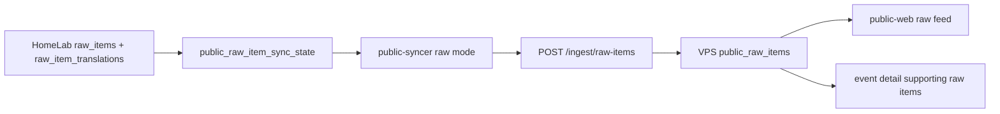

# Public Raw Items Feed Implementation Plan

狀態：本地實作完成，待部署與 dry-run 驗證。

目標：把 HomeLab `raw_items` 與其 public-safe 翻譯內容同步到 VPS `public-api` public database，作為獨立於 `public_events` 的原始資料 feed。此 feed 服務 public website 的資料瀏覽與 event detail supporting raw items，不替代現有事件摘要同步。

## 1. 審核結論

現有 `public_event.v1` contract 已穩定，不能把 raw item 內容塞進 `public_event.v1`，否則會同時破壞事件 payload、public website response shape、以及既有 `public-syncer` 的 `public_outbox` 狀態機。

Raw feed 應新增 `public_raw_item.v1`，並作為一條獨立資料管線：



審核後建議修正先前草案的一點：不要為 raw feed 做完全獨立的 replay audit 而忽略既有 `public_ingest_requests`。HMAC nonce 必須跨 `/ingest/events` 與 `/ingest/raw-items` 全局唯一。V1 建議擴展現有 `public_ingest_requests`，新增 `ingest_kind` 與 `public_raw_item_id`，而不是只靠新的 `public_raw_item_ingest_requests`。

## 2. Data Contract

`public_raw_item.v1` payload：

```json
{
  "schema_version": "public_raw_item.v1",
  "idempotency_key": "raw_item:<raw_item_id>:v1",
  "upstream_raw_item_id": "<uuid>",
  "source": {
    "name": "Source name",
    "source_type": "telegram",
    "source_group": "macro",
    "official_level": "official",
    "priority": "P1"
  },
  "source_url": "https://example.com/item",
  "published_at": "2026-06-13T01:23:45Z",
  "ingested_at": "2026-06-13T01:23:50Z",
  "edited_at": null,
  "title": "Clean title",
  "original_content": "scrubbed and capped text_clean",
  "language": "en",
  "media_type": "none",
  "summary_zh": "繁中摘要",
  "summary_en": "English summary",
  "full_translation_zh": "繁中全文翻譯，可能被截斷",
  "full_translation_en": "English full translation, possibly truncated",
  "translations": [
    {
      "language": "zh-Hant",
      "summary": "繁中摘要",
      "full_translation": "繁中全文翻譯",
      "status": "completed",
      "is_truncated": false,
      "source_chars": 1200,
      "translation_chars": 900
    }
  ],
  "classification": {
    "is_relevant": true,
    "relevance_score": 88,
    "filter_reason": null,
    "stage": "completed",
    "status": "completed"
  },
  "content_category": "geopolitics",
  "topic_tags": ["iran", "xauusd"],
  "mentioned_actors": ["Iran"],
  "upstream_event_ids": ["<uuid>"],
  "scrub_metadata": {
    "original_content_truncated": false,
    "source_text_chars": 1800,
    "max_original_content_chars": 4000,
    "max_full_translation_chars": 8000
  }
}
```

欄位規則：

- `idempotency_key` 固定為 `raw_item:<raw_item_id>:v1`。raw item 內容更新時仍用同一 key，API 使用 upsert 更新 public row。
- `upstream_raw_item_id` 是 HomeLab raw item UUID，用於 dedupe 與後續 event linking。
- `original_content` 只能來自 scrub 後的 `raw_items.text_clean`。不得同步 `text_raw`。
- `source_url` 只允許 `http://` / `https://`。Telegram private metadata 不得進入 payload。
- `translations` 只保留 public display 欄位：`language`、`summary`、`full_translation`、`status`、字數與截斷旗標。不得同步 model name、prompt、error、token usage。
- `upstream_event_ids` 由 `raw_item_processing.event_id` 與 `events.raw_item_ids` 推導，供 public event detail 查詢 supporting raw items。

## 3. VPS Public API

### Migration

新增 `services/public-api/migrations/versions/0003_public_raw_items.py`：

- `public_raw_items`
  - `id uuid primary key default gen_random_uuid()`
  - `upstream_raw_item_id uuid not null`
  - `idempotency_key text not null unique`
  - `schema_version text not null check (schema_version in ('public_raw_item.v1'))`
  - source fields：`source_name`、`source_type`、`source_group`、`official_level`、`priority`
  - time fields：`published_at`、`ingested_at`、`edited_at`、`received_at`
  - display fields：`title`、`original_content`、`language`、`media_type`
  - legacy fast fields：`summary_zh`、`summary_en`、`full_translation_zh`、`full_translation_en`
  - taxonomy：`content_category`、`topic_tags text[]`、`mentioned_actors text[]`
  - relation：`upstream_event_ids uuid[] not null default '{}'`
  - classification：`is_relevant`、`relevance_score`、`filter_reason`、`classification_status`
  - safety：`is_visible`、`is_truncated`、`source_text_chars`、`translation_chars`、`scrub_metadata jsonb`
  - `created_at`、`updated_at`
- `public_raw_item_translations`
  - `public_raw_item_id uuid references public_raw_items(id) on delete cascade`
  - `language`、`summary`、`full_translation`、`status`
  - `is_truncated`、`source_chars`、`translation_chars`
  - unique `(public_raw_item_id, language)`
- 擴展 `public_ingest_requests`
  - `ingest_kind text not null default 'event'`
  - `public_raw_item_id uuid references public_raw_items(id) on delete set null`
  - 放寬 `upstream_event_id` 的 nullable 語意；維持既有 event rows 有效。

Indexes:

- `public_raw_items_upstream_raw_item_uidx` on `upstream_raw_item_id`
- `public_raw_items_idempotency_key_uidx`
- `public_raw_items_published_idx` on `coalesce(published_at, ingested_at, received_at) desc`
- `public_raw_items_tags_gin_idx`
- `public_raw_items_upstream_event_ids_gin_idx`
- trigram indexes on `title`, `original_content`, translation `summary`, translation `full_translation`

### Models And Endpoints

在 `services/public-api/src/public_api/models.py` 新增 Pydantic models：

- `PublicRawItemIngestRequest`
- `PublicRawItemTranslationInput`
- `PublicRawItemSourceInput`
- `PublicRawItemListItem`

在 `services/public-api/src/public_api/db.py` 新增 repository methods：

- `ingest_raw_item(payload, raw_body, key_id, nonce)`
- `list_raw_items(page, page_size, lang, source_type, source_group, tag, category, q, event_id, min_relevance_score, from_time, to_time)`
- `get_raw_item(public_raw_item_id, lang)`
- `list_raw_items_for_event(public_event_id, lang)`，或支援 `GET /raw-items?event_id=<public_event_id>`

在 `services/public-api/src/public_api/app.py` 新增 routes：

- `POST /ingest/raw-items`
- `GET /raw-items`
- `GET /raw-items/{public_raw_item_id}`
- 後續可選：`GET /events/{public_event_id}/raw-items`

實作細節：將共用的 ingest 授權邏輯抽出成 helper，記錄被拒絕的 request 時附帶 `ingest_kind`。`nonce_seen()` 必須檢查所有 accepted/rejected 的 ingest rows，而不是只檢查 event rows。

## 4. HomeLab Public Syncer

### Local State

在 `db/migrations/versions/` 下新增主 DB migration：

```sql
create table public_raw_item_sync_state (
  raw_item_id uuid primary key references raw_items(id) on delete cascade,
  publish_status text not null default 'pending',
  retry_count integer not null default 0,
  last_error text,
  next_retry_at timestamptz,
  locked_by text,
  locked_at timestamptz,
  last_payload_hash text,
  external_web_id text,
  synced_at timestamptz,
  source_updated_at timestamptz not null,
  created_at timestamptz not null default now(),
  updated_at timestamptz not null default now()
);
```

`publish_status` 取值：`pending`、`sending`、`sent`、`retry`、`failed`、`skipped`。

V1 eligible 條件：

- 存在 `raw_items.text_clean` 或非空 title。
- `raw_items.translation_status in ('completed', 'completed_truncated', 'skipped')`，或至少一筆 `raw_item_translations.status in ('completed', 'completed_truncated')`。
- `raw_item_processing.is_relevant is true` 或 `relevance_score >= PUBLIC_RAW_MIN_RELEVANCE_SCORE`。
- `sources.archived_at is null` 且 source 為 public-safe。
- 預設排除 media-only 空內容 items。

為什麼不只靠 cursor：translations / classification 可能在 `raw_items.ingested_at` 之後才抵達，純 ingested cursor 會漏掉晚到的更新。state table 支援 backfill、retry、晚到的 translation refresh，以及基於 payload hash 的 no-op 偵測。

### Syncer Changes

在 `services/public-syncer`：

- 新增 settings：
  - `PUBLIC_SYNC_RAW_ITEMS_ENABLED=false`
  - `PUBLIC_RAW_BACKFILL_ENABLED=false`
  - `PUBLIC_RAW_BATCH_SIZE=20`
  - `PUBLIC_RAW_MIN_RELEVANCE_SCORE=50`
  - `PUBLIC_RAW_MAX_ORIGINAL_CHARS=4000`
  - `PUBLIC_RAW_MAX_TRANSLATION_CHARS=8000`
  - `PUBLIC_RAW_INGEST_PATH=/ingest/raw-items`
- 新增 models：
  - `PublicRawItem`
  - `PublicRawItemTranslation`
  - `PublicRawItemSyncResult`
- 新增 payload builder：
  - `build_raw_item_payload(item)`
  - `raw_item_idempotency_key_for(item)`
  - `sanitize_raw_item_text()`
  - deterministic truncation，含 `is_truncated` 與字數統計。
- 新增 DB methods：
  - `refresh_raw_item_sync_candidates(limit)`
  - `claim_next_raw_item(worker_id, lock_timeout_seconds, max_attempts)`
  - `mark_raw_item_sent/failed/skipped`
- 新增 provider 支援：
  - 讓 `PublicApiProvider.send(payload, idempotency_key, ingest_path="/ingest/events")` 成立。
  - response 同時接受 `public_event_id` 與 `public_raw_item_id`。

Run loop 策略：

- 既有 event sync 路徑維持不變。
- 每個 poll tick 先同步 event outbox，若啟用再同步 raw item feed。
- raw sync 與 event sync 分開 rate limit，避免 raw backfill 延誤高優先級事件發布。

## 5. Public Web

新增 raw feed 作為次要瀏覽介面：

- Route: `/:lang/raw`
- Detail: `/:lang/raw/:rawItemId`
- Event detail：透過 `GET /raw-items?event_id=<public_event_id>&page_size=10` 顯示 supporting raw items

Types/API：

- 新增 `PublicRawItem`、`PublicRawItemTranslation`、`RawItemFilters`。
- 新增 `listRawItems()` 與 `getRawItem()`。
- 新增 demo raw items，讓 public-web 在無 API 時也能運行。

UX 規則：

- 預設列表顯示 source、時間、title、在地化 summary、category/tags、relevance。
- Detail 頁顯示 summary、原文，以及可用的指定語言 `full_translation`。
- 長原文 / 翻譯區塊預設折疊。
- 除 debug/dev 環境外，不顯示內部 ID（public raw item ID 除外）。

## 6. Security And Privacy Acceptance

Production 啟用前的硬性要求：

- 單元測試須證明 payload builder 不會輸出 `raw_json`、`text_raw`、prompt、model raw response、token usage、私人通知狀態或 HomeLab URLs。
- Telegram scrub 測試須移除 chat IDs、private channel IDs、Telethon metadata、bot URLs、bearer/signature/API key 樣式。
- API 拒絕超過 `PUBLIC_INGEST_MAX_BODY_BYTES` 的 payload。
- API 拒絕無效 `schema_version`、無效 URL scheme、過長 title 與不支援的 translation language codes。
- HMAC replay 測試須驗證在 `/ingest/events` 用過的 nonce 不得在 `/ingest/raw-items` 重用。
- Backfill 可以 dry-run 模式執行，log 只記 payload hash / 數量，不輸出 body 內容。

## 7. Implementation Phases

### Phase A: Contract And Public API

檔案：

- `services/public-api/src/public_api/models.py`
- `services/public-api/src/public_api/db.py`
- `services/public-api/src/public_api/app.py`
- `services/public-api/migrations/versions/0003_public_raw_items.py`
- `services/public-api/tests/*`

交付物：

- DB migration。
- 含 HMAC 的 ingest endpoint。
- 支援 pagination / search / language fallback 的 read endpoints。
- 針對 validation、db shaping、replay protection 與 idempotent upsert 的測試。

驗證：

- `cd services/public-api && uv run pytest`
- 在一次性 Postgres 上執行 migration upgrade/downgrade。

### Phase B: HomeLab Raw Syncer

檔案：

- `db/migrations/versions/00xx_public_raw_item_sync_state.py`
- `services/public-syncer/src/public_syncer/models.py`
- `services/public-syncer/src/public_syncer/payload.py`
- `services/public-syncer/src/public_syncer/db.py`
- `services/public-syncer/src/public_syncer/providers.py`
- `services/public-syncer/src/public_syncer/worker.py`
- `services/public-syncer/tests/*`
- `infra/.env.example`
- `docs/services/public-syncer.md`

交付物：

- Raw sync state table。
- Candidate refresh 與 claim / mark 生命週期。
- Payload scrub / truncation。
- Dry-run 與 bounded backfill 模式。
- 獨立的 raw rate limits。

驗證：

- `cd services/public-syncer && uv run pytest`
- 對 HomeLab 樣本資料執行 dry-run，僅檢查數量 / hash / status。

### Phase C: Public Website

檔案：

- `apps/public-web/src/api/types.ts`
- `apps/public-web/src/api/client.ts`
- `apps/public-web/src/api/demoData.ts`
- `apps/public-web/src/pages/RawItemsPage.tsx`
- `apps/public-web/src/pages/RawItemDetailPage.tsx`
- `apps/public-web/src/pages/EventDetailPage.tsx`
- `apps/public-web/src/components/Layout.tsx`
- `apps/public-web/src/i18n/index.ts`

交付物：

- Raw feed 列表 / 詳情。
- Event detail 的 supporting raw item links。
- 支援語言的 i18n labels。

驗證：

- `cd apps/public-web && npm run typecheck && npm run build`
- 瀏覽器驗證 desktop/mobile raw list 與 event detail。

### Phase D: Deployment

順序：

1. 將 `public-api` migration 部署到 VPS。
2. 部署新版 `public-api` image；驗證 `/health`、`/raw-items` 空回應與 HMAC ingest 測試。
3. 以 `PUBLIC_SYNC_RAW_ITEMS_ENABLED=false` 部署 HomeLab `public-syncer`。
4. 本地執行一次性 dry-run / backfill。
5. 以小 `PUBLIC_RAW_BATCH_SIZE` 啟用 `PUBLIC_SYNC_RAW_ITEMS_ENABLED=true`。
6. 驗證數量、最新時間戳、重複行為與 public-web 渲染。

Rollback：

- 關閉 `PUBLIC_SYNC_RAW_ITEMS_ENABLED`。
- 保留 public-api read endpoints；若需立即隱藏公開內容，設定 `public_raw_items.is_visible=false`。
- Event sync 維持獨立，因為 `public_outbox` 與 `/ingest/events` 未變更。

## 8. Acceptance Checklist

- [x] `public_events` 行為在 code path 中維持不變。
- [x] 重送同一 raw item 會依 idempotency key 更新單一 `public_raw_items` row。
- [x] 後續有 translation / classification 更新的 raw item 可透過 `public_raw_item_sync_state` 重新同步。
- [x] Public API 可獨立於 events 列出 raw feed。
- [x] Public API 可透過 `GET /raw-items?event_id=...` 取得某事件的 supporting raw items。
- [x] Public website 對 summary + 原文 + full translation 做出明確區分的渲染。
- [x] Syncer payload 測試證明 private/internal 欄位不會出現在 raw payload 中。
- [x] Raw backfill 與 event sync 分開的 enable flag、batch size 與 rate limit。
- [ ] 部署 VPS `public-api` migration / image 並驗證 `/raw-items`。
- [ ] 以 `PUBLIC_SYNC_RAW_ITEMS_ENABLED=false` 部署 HomeLab migration / image。
- [ ] 啟用 raw sync 前，先在 production 執行 dry-run / backfill 樣本審查。

## 9. Open Decisions

- 預設可見性門檻：先以 `is_relevant=true OR relevance_score >= 50` 起步；待 dry-run 樣本審查後再調整。
- 最大內容長度：先以原文 `4000` 字、翻譯 `8000` 字起步；依 payload / body size 調整。
- 是否把低相關 raw items 放到公開 debug/filter 頁面之後：延後到 production 資料品質審查後決定。
- V1 是新增專屬 `GET /events/{id}/raw-items` route，還是使用 `GET /raw-items?event_id=...`：優先採用 query route；僅當 public-web code 明確受益時才加 nested route。
