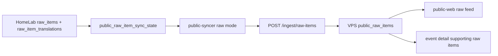

# Public Raw Items Feed Implementation Plan

狀態：本地實作完成，待部署與 dry-run 驗證。

目標：把 HomeLab `raw_items` 與其 public-safe 翻譯內容同步到 VPS `public-api` public database，作為獨立於 `public_events` 的原始資料 feed。此 feed 服務 public website 的資料瀏覽與 event detail supporting raw items，不替代現有事件摘要同步。

## 1. 審核結論

現有 `public_event.v1` contract 已穩定，不能把 raw item 內容塞進 `public_event.v1`，否則會同時破壞事件 payload、public website response shape、以及既有 `public-syncer` 的 `public_outbox` 狀態機。

Raw feed 應新增 `public_raw_item.v1`，並作為一條獨立資料管線：



審核後建議修正先前草案的一點：不要為 raw feed 做完全獨立的 replay audit 而忽略既有 `public_ingest_requests`。HMAC nonce 必須跨 `/ingest/events` 與 `/ingest/raw-items` 全局唯一。V1 建議擴展現有 `public_ingest_requests`，新增 `ingest_kind` 與 `public_raw_item_id`，而不是只靠新的 `public_raw_item_ingest_requests`。

## 2. Data Contract

`public_raw_item.v1` payload：

```json
{
  "schema_version": "public_raw_item.v1",
  "idempotency_key": "raw_item:<raw_item_id>:v1",
  "upstream_raw_item_id": "<uuid>",
  "source": {
    "name": "Source name",
    "source_type": "telegram",
    "source_group": "macro",
    "official_level": "official",
    "priority": "P1"
  },
  "source_url": "https://example.com/item",
  "published_at": "2026-06-13T01:23:45Z",
  "ingested_at": "2026-06-13T01:23:50Z",
  "edited_at": null,
  "title": "Clean title",
  "original_content": "scrubbed and capped text_clean",
  "language": "en",
  "media_type": "none",
  "summary_zh": "繁中摘要",
  "summary_en": "English summary",
  "full_translation_zh": "繁中全文翻譯，可能被截斷",
  "full_translation_en": "English full translation, possibly truncated",
  "translations": [
    {
      "language": "zh-Hant",
      "summary": "繁中摘要",
      "full_translation": "繁中全文翻譯",
      "status": "completed",
      "is_truncated": false,
      "source_chars": 1200,
      "translation_chars": 900
    }
  ],
  "classification": {
    "is_relevant": true,
    "relevance_score": 88,
    "filter_reason": null,
    "stage": "completed",
    "status": "completed"
  },
  "content_category": "geopolitics",
  "topic_tags": ["iran", "xauusd"],
  "mentioned_actors": ["Iran"],
  "upstream_event_ids": ["<uuid>"],
  "scrub_metadata": {
    "original_content_truncated": false,
    "source_text_chars": 1800,
    "max_original_content_chars": 4000,
    "max_full_translation_chars": 8000
  }
}
```

欄位規則：

- `idempotency_key` 固定為 `raw_item:<raw_item_id>:v1`。raw item 內容更新時仍用同一 key，API 使用 upsert 更新 public row。
- `upstream_raw_item_id` 是 HomeLab raw item UUID，用於 dedupe 與後續 event linking。
- `original_content` 只能來自 scrub 後的 `raw_items.text_clean`。不要同步 `text_raw`。
- `source_url` 只允許 `http://` / `https://`。Telegram private metadata 不得進 payload。
- `translations` 只保留 public display 欄位：`language`、`summary`、`full_translation`、`status`、字數與截斷旗標。不要同步 model name、prompt、error、token usage。
- `upstream_event_ids` 從 `raw_item_processing.event_id` 與 `events.raw_item_ids` 推導，用於 public event detail 查 supporting raw items。

## 3. VPS Public API

### Migration

新增 `services/public-api/migrations/versions/0003_public_raw_items.py`：

- `public_raw_items`
  - `id uuid primary key default gen_random_uuid()`
  - `upstream_raw_item_id uuid not null`
  - `idempotency_key text not null unique`
  - `schema_version text not null check (schema_version in ('public_raw_item.v1'))`
  - source fields：`source_name`、`source_type`、`source_group`、`official_level`、`priority`
  - time fields：`published_at`、`ingested_at`、`edited_at`、`received_at`
  - display fields：`title`、`original_content`、`language`、`media_type`
  - legacy fast fields：`summary_zh`、`summary_en`、`full_translation_zh`、`full_translation_en`
  - taxonomy：`content_category`、`topic_tags text[]`、`mentioned_actors text[]`
  - relation：`upstream_event_ids uuid[] not null default '{}'`
  - classification：`is_relevant`、`relevance_score`、`filter_reason`、`classification_status`
  - safety：`is_visible`、`is_truncated`、`source_text_chars`、`translation_chars`、`scrub_metadata jsonb`
  - `created_at`、`updated_at`
- `public_raw_item_translations`
  - `public_raw_item_id uuid references public_raw_items(id) on delete cascade`
  - `language`、`summary`、`full_translation`、`status`
  - `is_truncated`、`source_chars`、`translation_chars`
  - unique `(public_raw_item_id, language)`
- Extend `public_ingest_requests`
  - `ingest_kind text not null default 'event'`
  - `public_raw_item_id uuid references public_raw_items(id) on delete set null`
  - relax `upstream_event_id` nullable semantics; keep existing event rows valid.

Indexes:

- `public_raw_items_upstream_raw_item_uidx` on `upstream_raw_item_id`
- `public_raw_items_idempotency_key_uidx`
- `public_raw_items_published_idx` on `coalesce(published_at, ingested_at, received_at) desc`
- `public_raw_items_tags_gin_idx`
- `public_raw_items_upstream_event_ids_gin_idx`
- trigram indexes on `title`, `original_content`, translation `summary`, translation `full_translation`

### Models And Endpoints

Add Pydantic models in `services/public-api/src/public_api/models.py`:

- `PublicRawItemIngestRequest`
- `PublicRawItemTranslationInput`
- `PublicRawItemSourceInput`
- `PublicRawItemListItem`

Add repository methods in `services/public-api/src/public_api/db.py`:

- `ingest_raw_item(payload, raw_body, key_id, nonce)`
- `list_raw_items(page, page_size, lang, source_type, source_group, tag, category, q, event_id, min_relevance_score, from_time, to_time)`
- `get_raw_item(public_raw_item_id, lang)`
- `list_raw_items_for_event(public_event_id, lang)` or support `GET /raw-items?event_id=<public_event_id>`

Add routes in `services/public-api/src/public_api/app.py`:

- `POST /ingest/raw-items`
- `GET /raw-items`
- `GET /raw-items/{public_raw_item_id}`
- optional later: `GET /events/{public_event_id}/raw-items`

Implementation detail: extract common ingest authorization into a helper that records rejected requests with `ingest_kind`. `nonce_seen()` must check all accepted/rejected ingest rows, not only event rows.

## 4. HomeLab Public Syncer

### Local State

Add a main DB migration under `db/migrations/versions/`:

```sql
create table public_raw_item_sync_state (
  raw_item_id uuid primary key references raw_items(id) on delete cascade,
  publish_status text not null default 'pending',
  retry_count integer not null default 0,
  last_error text,
  next_retry_at timestamptz,
  locked_by text,
  locked_at timestamptz,
  last_payload_hash text,
  external_web_id text,
  synced_at timestamptz,
  source_updated_at timestamptz not null,
  created_at timestamptz not null default now(),
  updated_at timestamptz not null default now()
);
```

`publish_status` values: `pending`、`sending`、`sent`、`retry`、`failed`、`skipped`。

Eligibility V1:

- `raw_items.text_clean` or non-empty title exists.
- `raw_items.translation_status in ('completed', 'completed_truncated', 'skipped')` or at least one `raw_item_translations.status in ('completed', 'completed_truncated')`.
- `raw_item_processing.is_relevant is true` or `relevance_score >= PUBLIC_RAW_MIN_RELEVANCE_SCORE`.
- `sources.archived_at is null` and source is public-safe.
- Exclude media-only empty items by default.

Why not cursor only: translations/classification can arrive after `raw_items.ingested_at`, so a pure ingested cursor would miss late updates. The state table allows backfill, retries, late translation refresh, and payload hash based no-op detection.

### Syncer Changes

In `services/public-syncer`:

- Add settings:
  - `PUBLIC_SYNC_RAW_ITEMS_ENABLED=false`
  - `PUBLIC_RAW_BACKFILL_ENABLED=false`
  - `PUBLIC_RAW_BATCH_SIZE=20`
  - `PUBLIC_RAW_MIN_RELEVANCE_SCORE=50`
  - `PUBLIC_RAW_MAX_ORIGINAL_CHARS=4000`
  - `PUBLIC_RAW_MAX_TRANSLATION_CHARS=8000`
  - `PUBLIC_RAW_INGEST_PATH=/ingest/raw-items`
- Add models:
  - `PublicRawItem`
  - `PublicRawItemTranslation`
  - `PublicRawItemSyncResult`
- Add payload builder:
  - `build_raw_item_payload(item)`
  - `raw_item_idempotency_key_for(item)`
  - `sanitize_raw_item_text()`
  - deterministic truncation with `is_truncated` and char counts.
- Add DB methods:
  - `refresh_raw_item_sync_candidates(limit)`
  - `claim_next_raw_item(worker_id, lock_timeout_seconds, max_attempts)`
  - `mark_raw_item_sent/failed/skipped`
- Add provider support:
  - make `PublicApiProvider.send(payload, idempotency_key, ingest_path="/ingest/events")`
  - accept both `public_event_id` and `public_raw_item_id` in response.

Run loop strategy:

- Keep current event sync path unchanged.
- In each poll tick, sync event outbox first, then raw item feed if enabled.
- Rate limit raw sync separately from event sync so raw backfill does not delay high-priority event publishing.

## 5. Public Web

Add raw feed as a secondary browsing surface:

- Route: `/:lang/raw`
- Detail: `/:lang/raw/:rawItemId`
- Event detail: show supporting raw items from `GET /raw-items?event_id=<public_event_id>&page_size=10`

Types/API:

- Add `PublicRawItem`, `PublicRawItemTranslation`, `RawItemFilters`.
- Add `listRawItems()` and `getRawItem()`.
- Add demo raw items so public-web can run without API.

UX rules:

- Default list shows source, time, title, localized summary, category/tags, relevance.
- Detail page shows summary, original content, and selected-language `full_translation` if available.
- Long original/translation blocks are collapsed by default.
- Do not show internal IDs except public raw item ID in debug/dev contexts.

## 6. Security And Privacy Acceptance

Hard requirements before production enablement:

- Unit tests prove payload builder never emits `raw_json`, `text_raw`, prompt, model raw response, token usage, private notification state, or HomeLab URLs.
- Telegram scrub tests remove chat IDs, private channel IDs, Telethon metadata, bot URLs, bearer/signature/API key patterns.
- API rejects payloads over `PUBLIC_INGEST_MAX_BODY_BYTES`.
- API rejects invalid `schema_version`, invalid URL schemes, overlong titles, and unsupported translation language codes.
- HMAC replay test verifies a nonce used on `/ingest/events` cannot be reused on `/ingest/raw-items`.
- Backfill can run in dry-run mode and log payload hash/counts without sending body content to logs.

## 7. Implementation Phases

### Phase A: Contract And Public API

Files:

- `services/public-api/src/public_api/models.py`
- `services/public-api/src/public_api/db.py`
- `services/public-api/src/public_api/app.py`
- `services/public-api/migrations/versions/0003_public_raw_items.py`
- `services/public-api/tests/*`

Deliverables:

- DB migration.
- Ingest endpoint with HMAC.
- Read endpoints with pagination/search/language fallback.
- Tests for validation, db shaping, replay protection, and idempotent upsert.

Validation:

- `cd services/public-api && uv run pytest`
- Migration upgrade/downgrade against a disposable Postgres.

### Phase B: HomeLab Raw Syncer

Files:

- `db/migrations/versions/00xx_public_raw_item_sync_state.py`
- `services/public-syncer/src/public_syncer/models.py`
- `services/public-syncer/src/public_syncer/payload.py`
- `services/public-syncer/src/public_syncer/db.py`
- `services/public-syncer/src/public_syncer/providers.py`
- `services/public-syncer/src/public_syncer/worker.py`
- `services/public-syncer/tests/*`
- `infra/.env.example`
- `docs/services/public-syncer.md`

Deliverables:

- Raw sync state table.
- Candidate refresh and claim/mark lifecycle.
- Payload scrub/truncation.
- Dry-run and bounded backfill mode.
- Separate raw rate limits.

Validation:

- `cd services/public-syncer && uv run pytest`
- Run dry-run against HomeLab sample data and inspect only counts/hashes/status.

### Phase C: Public Website

Files:

- `apps/public-web/src/api/types.ts`
- `apps/public-web/src/api/client.ts`
- `apps/public-web/src/api/demoData.ts`
- `apps/public-web/src/pages/RawItemsPage.tsx`
- `apps/public-web/src/pages/RawItemDetailPage.tsx`
- `apps/public-web/src/pages/EventDetailPage.tsx`
- `apps/public-web/src/components/Layout.tsx`
- `apps/public-web/src/i18n/index.ts`

Deliverables:

- Raw feed list/detail.
- Event detail supporting raw item links.
- i18n labels for supported languages.

Validation:

- `cd apps/public-web && npm run typecheck && npm run build`
- Browser verification for desktop/mobile raw list and event detail.

### Phase D: Deployment

Order:

1. Deploy `public-api` migration to VPS.
2. Deploy new `public-api` image; verify `/health`, `/raw-items` empty response, and HMAC ingest test.
3. Deploy HomeLab `public-syncer` with `PUBLIC_SYNC_RAW_ITEMS_ENABLED=false`.
4. Run one-shot dry-run/backfill locally.
5. Enable `PUBLIC_SYNC_RAW_ITEMS_ENABLED=true` with small `PUBLIC_RAW_BATCH_SIZE`.
6. Verify counts, latest timestamps, duplicate behavior, and public-web rendering.

Rollback:

- Disable `PUBLIC_SYNC_RAW_ITEMS_ENABLED`.
- Keep public-api read endpoints; set `public_raw_items.is_visible=false` if public content needs immediate hiding.
- Event sync remains independent because `public_outbox` and `/ingest/events` are unchanged.

## 8. Acceptance Checklist

- [x] `public_events` behavior is unchanged in code path.
- [x] Re-sending the same raw item updates one `public_raw_items` row by idempotency key.
- [x] Raw item with later translation/classification update is eligible for re-sync through `public_raw_item_sync_state`.
- [x] Public API can list raw feed independently of events.
- [x] Public API can fetch supporting raw items for an event through `GET /raw-items?event_id=...`.
- [x] Public website renders summary + original content + full translation distinctly.
- [x] Syncer payload tests prove private/internal fields are excluded from raw payload.
- [x] Raw backfill has separate enable flag, batch size and rate limit from event sync.
- [ ] Deploy VPS `public-api` migration/image and verify `/raw-items`.
- [ ] Deploy HomeLab migration/image with `PUBLIC_SYNC_RAW_ITEMS_ENABLED=false`.
- [ ] Run production dry-run/backfill sample review before enabling raw sync.

## 9. Open Decisions

- Default visibility threshold: start with `is_relevant=true OR relevance_score >= 50`; tune after dry-run sample review.
- Maximum content size: start with `4000` original chars and `8000` translation chars; adjust based on payload/body size.
- Whether to show low-relevance raw items behind a public debug/filter page: defer until production data quality is reviewed.
- Whether to add a dedicated `GET /events/{id}/raw-items` route in V1 or use `GET /raw-items?event_id=...`: prefer query route first; add nested route only if public-web code benefits.
